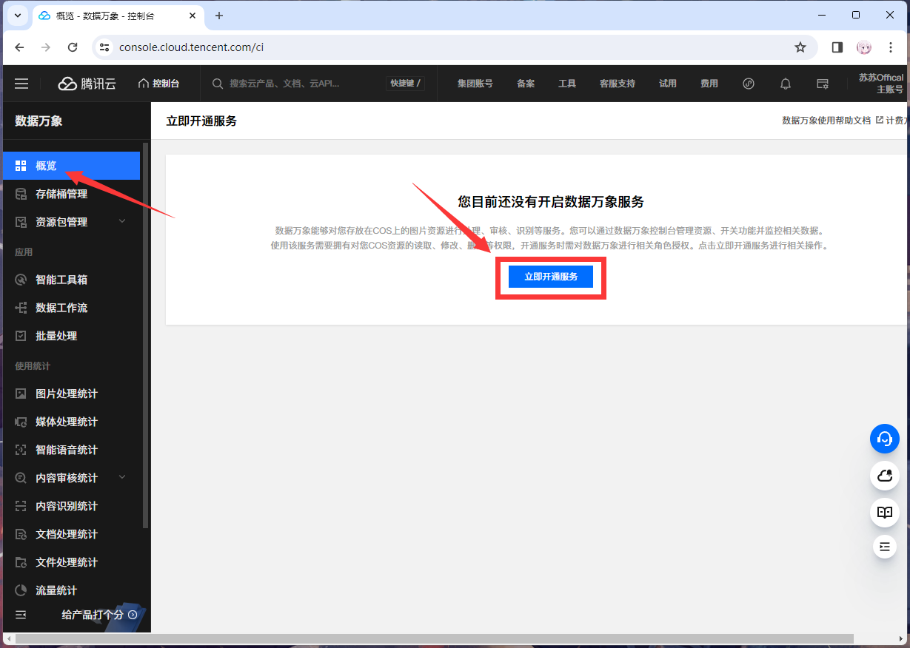
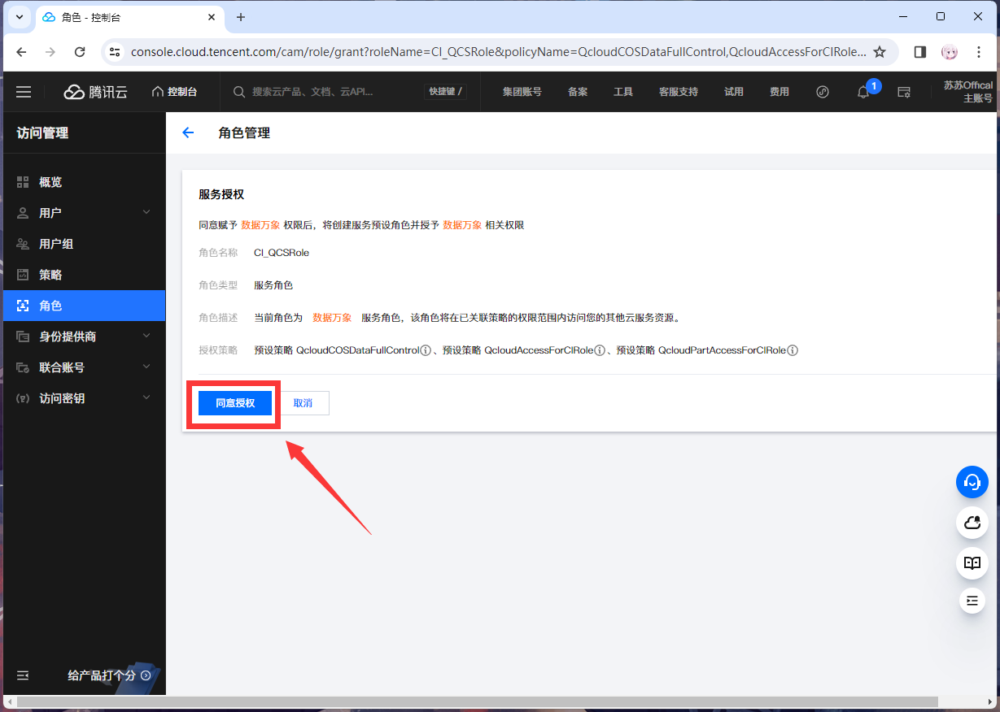
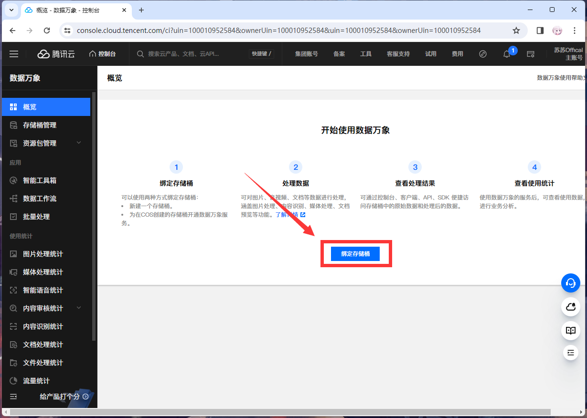
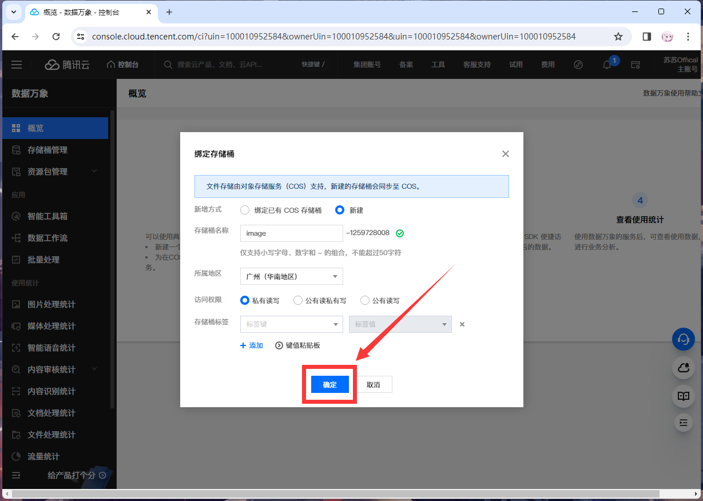
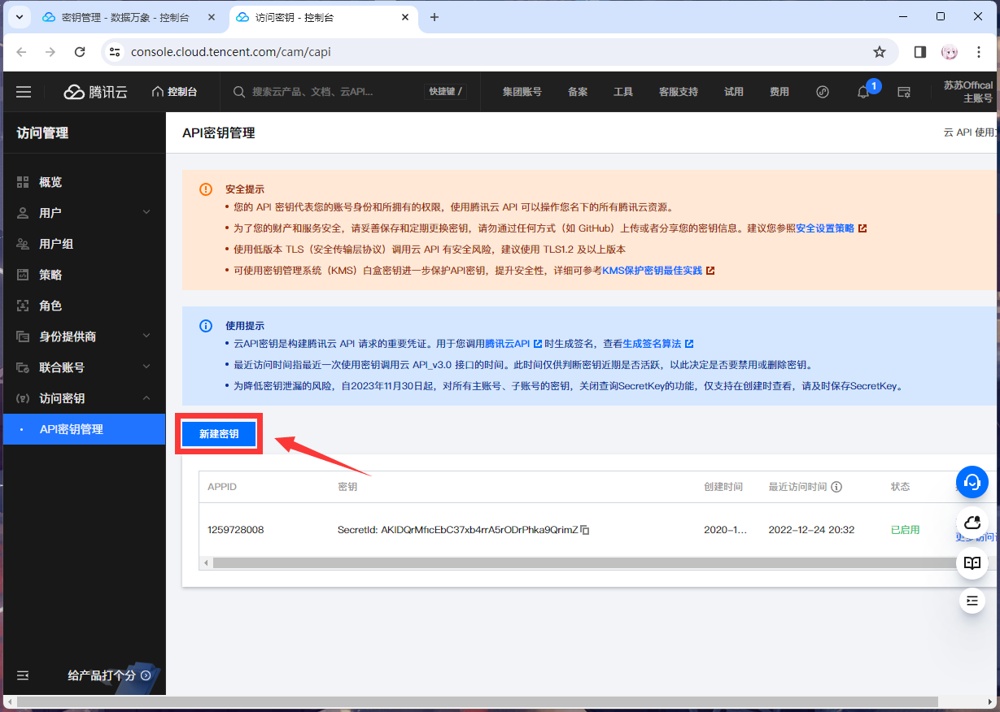
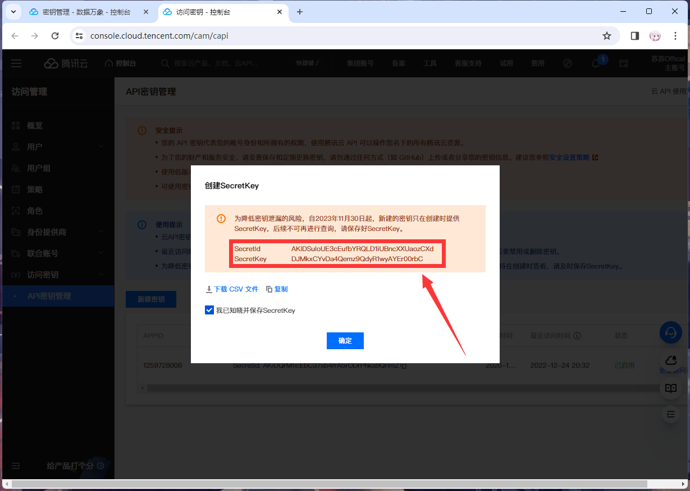

### 概述
本功能将使用数据万象 CI 为用户提供低延时、准确、标签丰富的内容审核服务，采用前沿的识别算法，结合海量的违规数据进行训练建模，对用户业务中的图片、音视频、文本、文档、网页进行敏感内容审核，过滤场景包括色情性感、违法违规、广告宣传等多个场景下的数百个标签，能够做到识别准确率高、召回率高，多维度覆盖对内容审核的要求，并实时跟进监管要求，不停地更新审核服务的识别标准和能力。

### 价格
数据万象（Cloud Infinite，CI）面向所有用户提供一定量的免费额度，可用于抵扣 CI 大部分功能费用。若使用量超出免费额度，则超出的部分需要另外付费。图片审核、视频审核、音频审核、文本审核、文档审核、网页审核，免费额度为10万次，有效期为2个月，同时，在 [数据万象CI专场特惠](https://cloud.tencent.com/act/pro/ci) 中，新用户可以低价购买10万次付费额度，有效期1年

### 配置
配置本功能需要获取5个值，分别为 `SecretId`、`SecretKey`、`Bucket`、`Region`、`BizType`，请按照本教程的顺序一个一个值获取：

#### 获取 Bucket
- 登录 [数据万象控制台](https://console.cloud.tencent.com/ci) ，点击 **概览** ，再点击 **立即开通服务**
  

- 点击 **授权**
  

- 点击 **同意授权**
  

- 点击 **绑定存储桶**

- 点击 **新建** ，输入存储桶名称，选择一个 **所属地域** ，点击 **确定**

:::danger
内容审核仅支持以下地域：北京、上海、广州、成都、重庆、南京、中国香港、新加坡、孟买、法兰克福
:::

:::tip

Bucket 的值为存储桶名称，一般由你输入的存储桶名称加上十位随机数组成，例如 `test-1250000000`
:::

#### 获取 Region
- Region 的值一般为 `ap-` 加上你选择的 **所属地域** 的拼音，以下为对照表：

  | 所属地域               |         地域 |
  | :--------------------- | -----------: |
  | 华北地区（北京）       |   ap-beijing |
  | 华东地区（上海）       |  ap-shanghai |
  | 华南地区（广州）       | ap-guangzhou |
  | 西南地区（成都）       |   ap-chengdu |
  | 西南地区（重庆）       | ap-chongqing |
  | 华东地区（南京）       |   ap-nanjing |
  | 港澳台地区（中国香港） |  ap-hongkong |
  | 亚太东南地区（新加坡） | ap-singapore |
  | 亚太东南地区（孟买）   |    ap-mumbai |
  | 欧洲地区（法兰克福）   | eu-frankfurt |

:::tip
Region 的值为存储桶所在的地域，例如 `ap-beijing`
:::

#### 获取 BizType
- 找到刚才新建的存储桶，点击 **管理**，点击 **内容审核**，点击 **审核策略**，复制默认策略的 `BizType` 值

:::tip
BizType 的值为审核策略的名称，例如 `912f9a305ae1101b9f7430435ec51f66`
:::

#### 获取 SecretId
1. 登录 [访问管理控制台](https://console.cloud.tencent.com/ci/secret) ，点击 **云 API 密钥**

2. 点击 **新建密钥**，

3. 请先牢记 `SecretId` 和 `SecretKey`，然后点击 **确定**

:::danger
SecretKey 只会展示一次，关闭后将再也无法看见，且尤为重要，请务必保存好
:::

:::tip
SecretId 的值请自行参考上述步骤获取
:::

#### 获取 SecretKey
- 参考 获取 [SecretId](https://docs.yunzai.art/plugins/nai-plugin/configuration/configuration2.html#%E8%8E%B7%E5%8F%96-secretid) 步骤获取 `SecretKey`

:::tip
SecretKey 的值请自行参考上述步骤获取
:::

