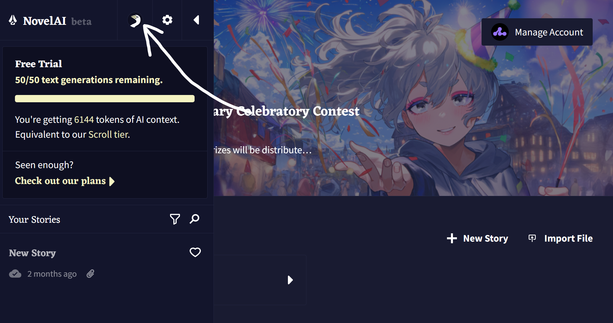
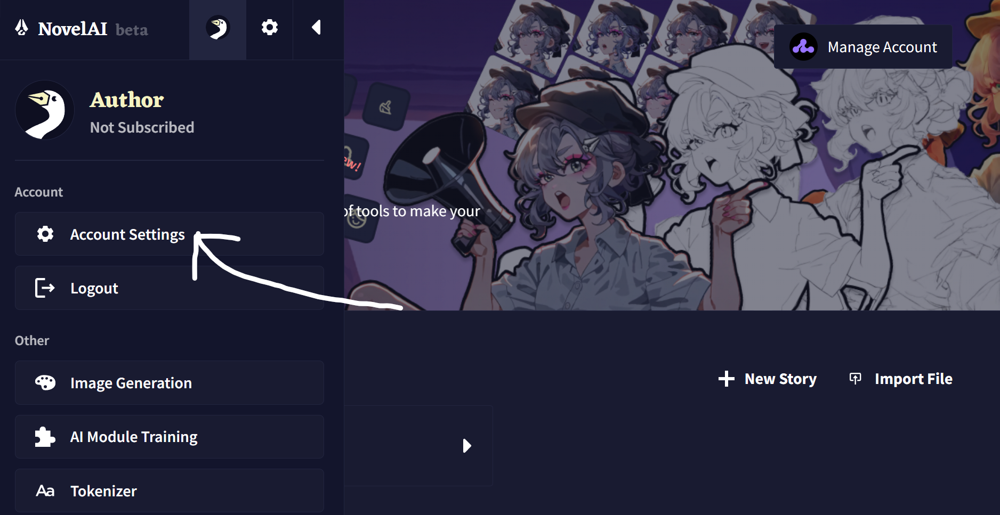
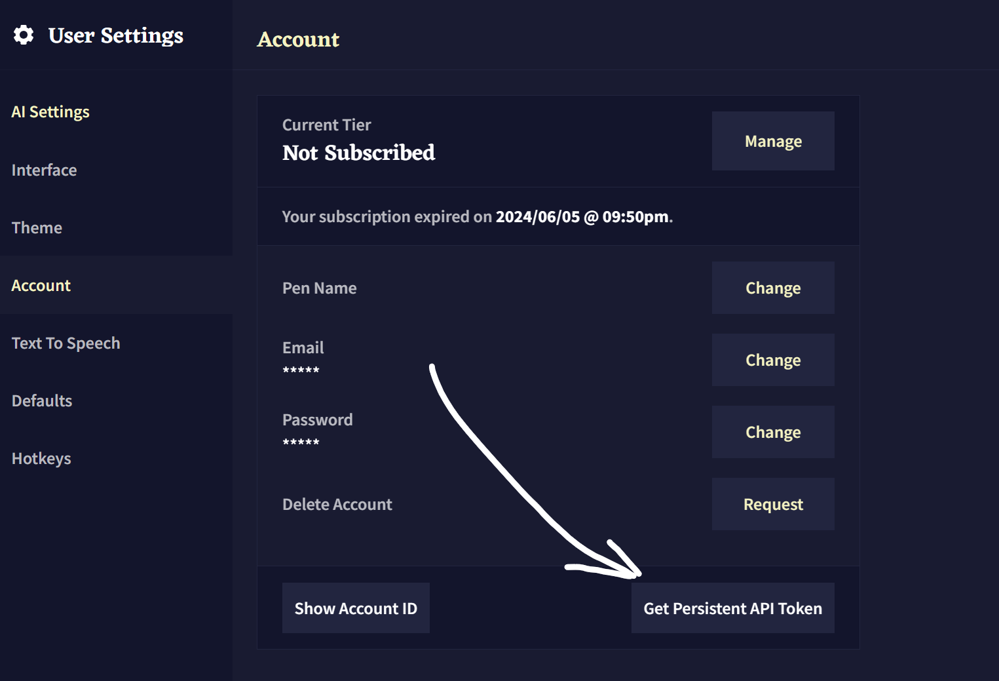

#### 登录 novelai

- 打开并登录 [novelai](https://novelai.net/stories)
  
#### 获取永久Token







- 把这个永久token复制下来
- 用锅巴设置填入账号池中


### 百度翻译Token

- 打开并登录 [百度翻译开放平台](https://api.fanyi.baidu.com/api/trans/product/desktop) 获取 ```APP ID``` 和 ```密钥```

