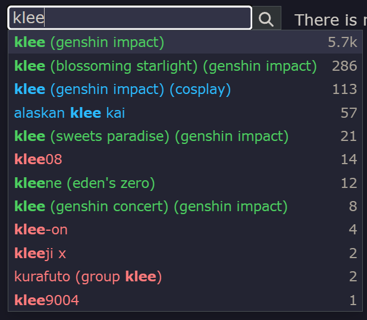
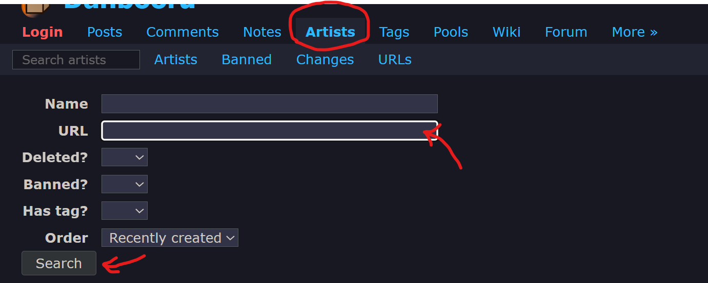

## 第一种
- 使用中文描述后，用翻译软件或chatgpt翻译成英文（或者自己写>_<）。
## 第二种
- 去 [danbooru](https://danbooru.donmai.us/) 或黄三角或其他booru网站，自行查看每种图片的tag后，自行加入你想要的tag中。

- 如何获取p站画师名
  -  在Pixiv或推特（X.com）找到喜欢的画师主页链接，把链接放到D站的artists搜索页

## 第三种

- 使用 [标签超市](https://tags.novelai.dev/) 自行组合标签
:::tip[偷偷地说]
好孩子不要开启右上角的*分级限制*哦
:::

## 第四种
- 在群里求大佬给词条
:::note
注意礼仪哦
:::