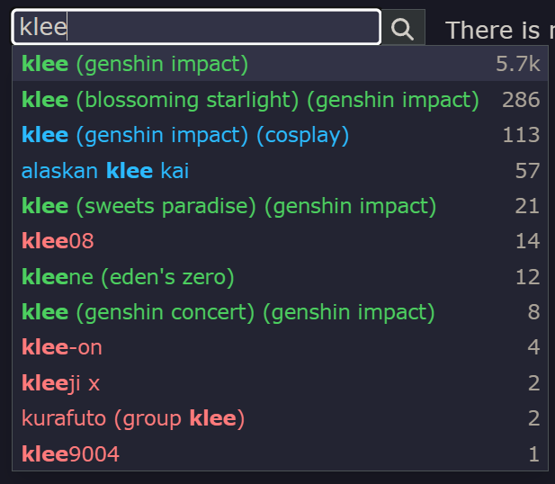
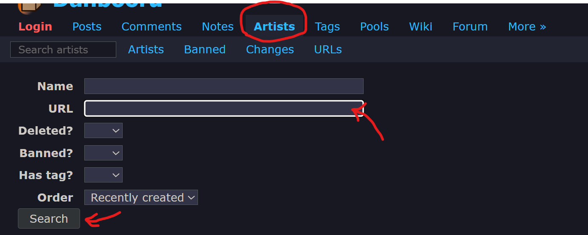

import { LinkCard, CardGrid } from '@astrojs/starlight/components';

:::tip[引言]
提示词（Tags）就如同画家手中的调色板，精确的标签组合能够将你脑海中的创意完美呈现，下面是几种常见的提示词的编写方法。
:::

## 第一种 标签生成器

🍈[点我展开]

<LinkCard
  title="⭐tags生成器"
  description="宝宝巴士也会用的标签选择器"
  href="https://tag-select.nai4.top/"
/>

<LinkCard
  title="tags生成器（镜像站）"
  description="宝宝巴士也会用的标签选择器（镜像站）"
  href="https://nai4-tag-select.pages.dev/"
/>

<LinkCard
  title="NovelAi(NAIFU)"
  description="最后更新时间2024年3月"
  href="https://novelai.netlify.app/"
/>

<LinkCard
  title="NovelAiTag 标签超市"
  description="最后更新时间2022年"
  href="https://thereisnospon.github.io/NovelAiTag/"
/>

<LinkCard
  title="Danbooru 标签超市"
  description="最后更新时间也是2022年"
  href="https://tags.novelai.dev/"
/>

### 第二种 开源tag法典

🍓[点我展开]

<LinkCard
  title="所长常规NovalAI个人法典"
  description="所长常规NovalAI个人法典和色色法典"
  href="../../../法典/所长常规novalai个人法典/"
/>
<LinkCard
  title="元素法典第一~五卷"
  description="这是一本免费、开源的法典"
  href="https://docs.qq.com/doc/DWGh4QnZBVlJYRkly"
/>
<LinkCard
  title="NovelAiV3-人物tags"
  description="本文档部分借鉴AI模型博物馆作品《人物tag》"
  href="https://docs.qq.com/sheet/DRFBYSHNoUkRqZlVv?tab=BB08J2"
/>
<LinkCard
  title="服装notion笔记"
  description="上身 下身 服装穿搭提示词"
  href="https://www.notion.so/ea163bebdce44785adf38041ac35ed6e#6cd3e15dfc3347fb9811bec8bc910c02"
/>
<LinkCard
  title="森林的NAI-V3法典"
  description="原本一堆人指望让NAI爆金币，结果现在都给NAI送钱了"
  href="https://docs.qq.com/doc/DSU9CZHhLRERRbllw"
/>
<LinkCard
  title="绘世法师见闻录"
  description="这是一本免费、开源的魔法书，欢迎任何人向编纂者投稿记录自己的魔法。"
  href="https://docs.qq.com/doc/DR0d3aEdzSmxORE5w"
/>
<LinkCard
  title="旧日黎明——献给朋友们的法术书"
  description="如果您对本文档较为满意，建议导出为副本保存一份，以防文档丢失。"
  href="https://www.kdocs.cn/l/caGSIQNOfNDO"
/>
<LinkCard
  title="Danbooru tag 组"
  description="Danbooru网站的tag标签组分类"
  href="https://danbooru.donmai.us/wiki_pages/tag_groups"
/>
<LinkCard
  title="Danbooru 服装 tag"
  description="Danbooru网站的tag标签组服装分类"
  href="https://danbooru.donmai.us/wiki_pages/tag_group%3Aattire"
/>
<LinkCard
  title="人偶教室：风格化教学"
  description="胧雨夜 NovelAI note"
  href="https://www.yuque.com/longyuye/lmgcwy"
/>
<LinkCard
  title="手抄本法术"
  description="Google文档"
  href="https://docs.google.com/spreadsheets/d/14Gg1kIGWdZGXyCC8AgYVT0lqI6IivLzZOdIT3QMWwVI/edit?pli=1&gid=685247369#gid=685247369"
/>
<LinkCard
  title="Prompt Search"
  description="一个供用户上传图片和tag的社区"
  href="https://www.ptsearch.info/home/"
/>
<LinkCard
  title="midjourney explore"
  description="一个供用户上传MJ图片和tag的社区"
  href="https://www.midjourney.com/explore?tab=top"
/>

## 第三种 翻译
- 使用中文描述后，用翻译软件或chatgpt翻译成英文（或者自己写>_\<）。

## 第四种 标签分类图站
#### 查找角色名：
- 去 [danbooru](https://danbooru.donmai.us/) 或 [黄三角](https://chan.sankakucomplex.com) 或其他booru网站，自行查看每种图片的tag后，自行加入你想要的tag中。

#### 查找p站画师名：
-  在Pixiv或推特（X.com）找到喜欢的画师主页链接，把链接放到D站的[artists搜索页](https://safebooru.donmai.us/artists?page=1)

### 第五种 QAQ
- 在群里求大佬给词条，哭哭
:::note
注意礼仪哦
:::