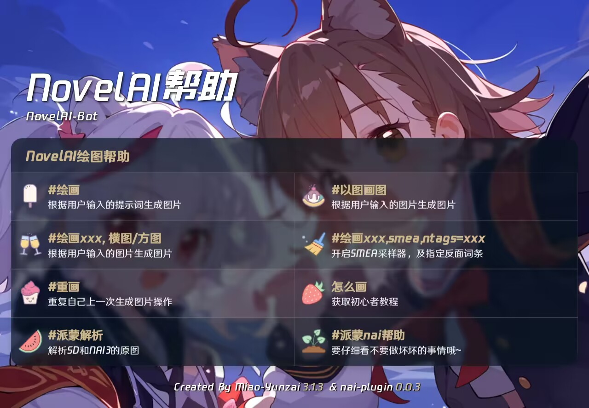

## 什么是NAI？

NAI Diffusion是 [NovelAi](https://novelai.net/image) 推出的基于Stable Diffusion（稳定扩散）算法的自动生成二次元图片的**付费**服务；其二次元模型在AI绘图领域处于断崖式领先水平，且能够模仿指定画师画风生成图片。[本插件](https://github.com/misaka20002/nai-plugin)让你在输入框即可以使用 NovelAi 的全部功能。

## 获取指令
- 可以通过 #绘画帮助 来获得绘画指令

## 常用指令

- 可以通过 #派蒙nai帮助 来获得更多指令
:::tip[#派蒙nai帮助]
派蒙nai绘画指令：

    #绘画[tags],
    #以图画图[tags],

 额外触发词：

    竖图/横图/方图,
    毛茸茸模型,

 使用特殊采样器：

    smea, 

 关闭DYN的SMEA采样器：

    smea, dynoff,

 指定反面词条：

    ntags = [tags],
 :::
 
