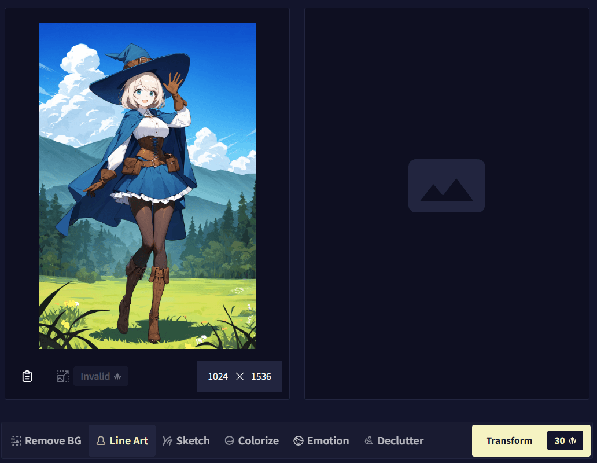
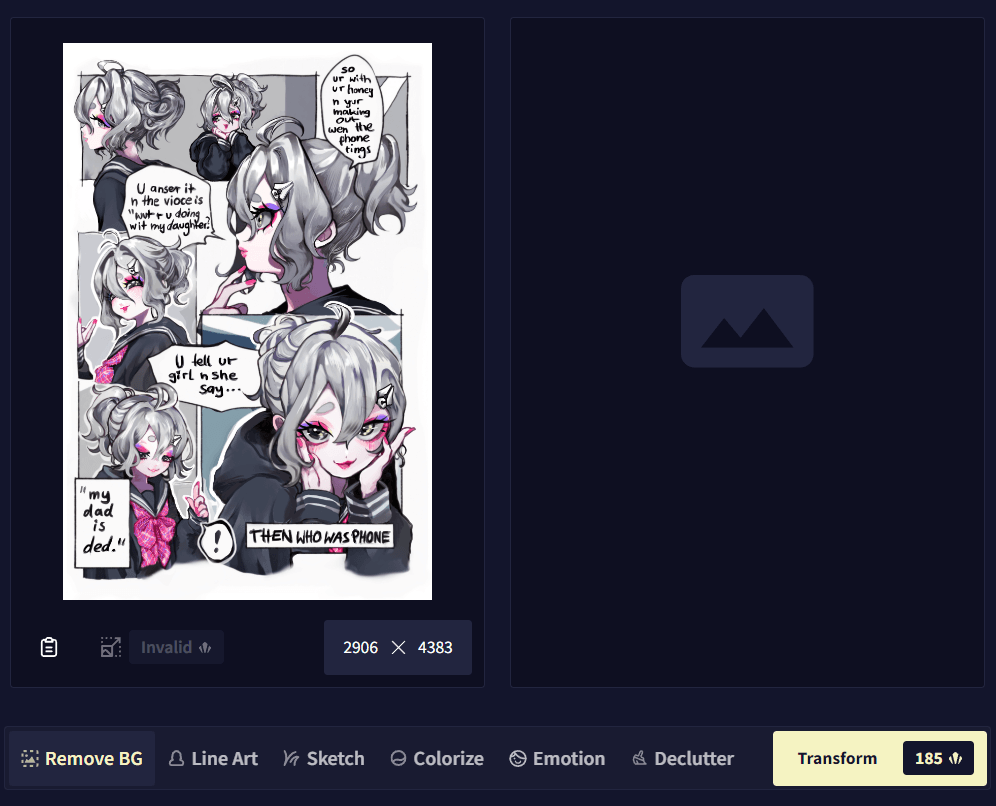
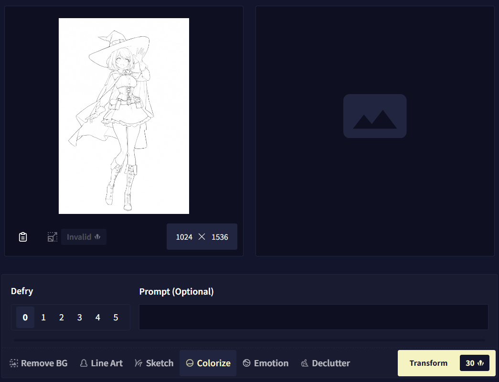
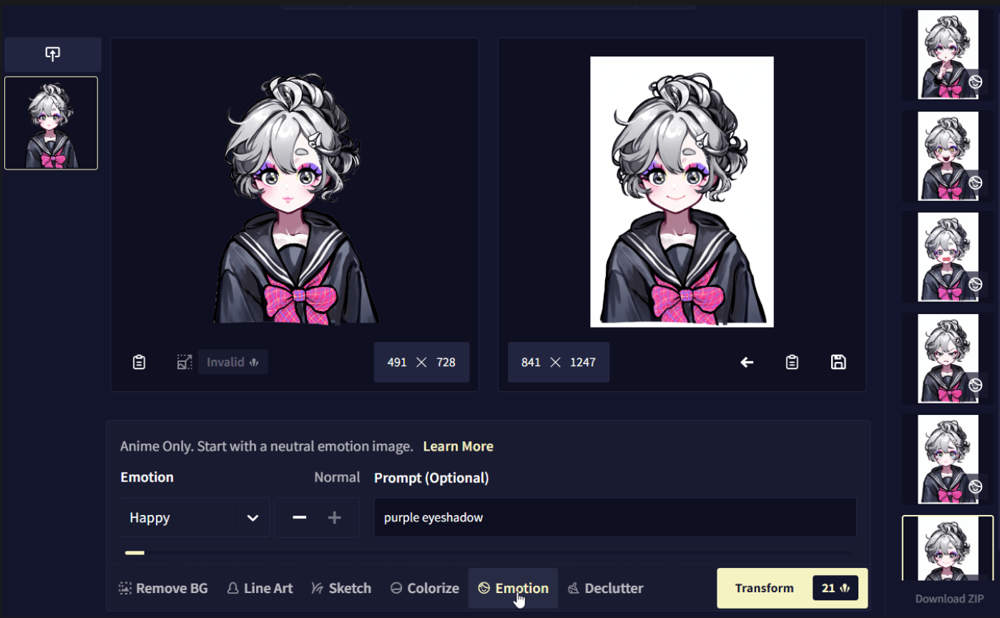
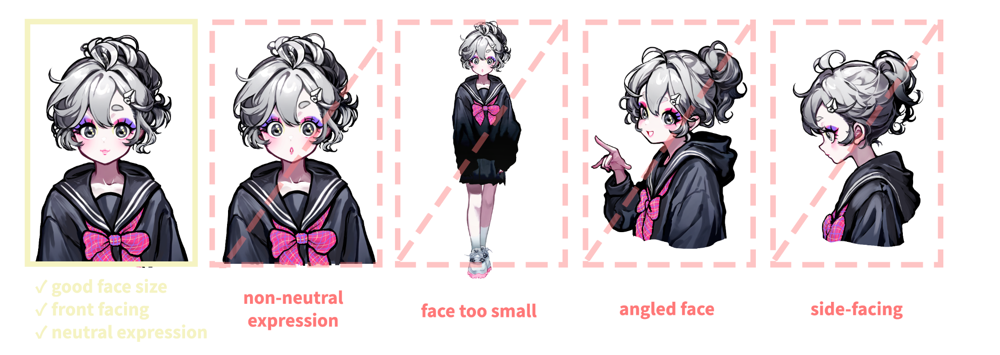

:::tip
- 命令直接引用图片发给 bot 即可
- 以下动图摘取自NovelAi官网
:::

#### #以图画图转线稿

:::note
- 不可附加 tags
:::

#### #以图画图转草图

:::note
- 不可附加 tags
:::

#### #以图画图删文字

:::note
- 不可附加 tags
:::

#### #以图画图重上色

 #以图画图上色

:::note[#以图画图重上色[tags]]
- 可附加 tags(tags过长会返回500错误)
- #以图画图重上色artist:ciloranko, [artist:tianliang duohe fangdongye], [artist:sho_(sho_lwlw)], [artist:baku-p], [artist:tsubasa_tsubasa],
:::

#### #以图画图换表情
 
可选表情：

- 平静|开心|伤心|生气|害怕|吃惊|疲惫|兴奋|紧张|思考|困惑|害羞|厌恶|得意|无聊|大笑|恼怒|激情|尴尬|担心|爱意|坚定|受伤|调皮
- neutral|happy|sad|angry|scared|surprised|tired|excited|nervous|thinking|confused|shy|disgusted|smug|bored|laughing|irritated|aroused|embarrassed|worried|love|determined|hurt|playful

:::note[#以图画图换表情[表情][tags]]
- 可附加 tags(tags过长会返回500错误)
- #以图画图换表情开心nahida(genshin),
:::

:::tip
- 人物在平静表情状态下表现最好
:::

