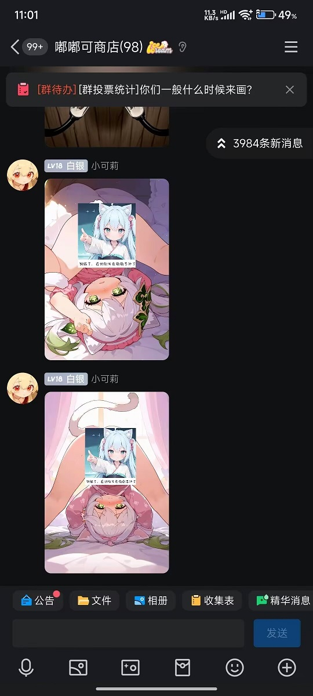

import { LinkCard, CardGrid } from '@astrojs/starlight/components';

### 介绍
- **画风**是由单个/多个画师串组合而成的
- 例如：\{ artist:ciloranko\} , [artist:tianliang duohe fangdongye], [artist:sho_(sho_lwlw)], [artist:baku-p ],  就是由4名画师名称组合而成
- 而最终画面效果取决于：
  - 画师名称的先后顺序
  - 画师名称的加减权重
    - \{\} 为加权
    - [] 为降权
- 所以定义画风就是排列组合各种画师名称
:::tip[偷偷地说]
聪明的小伙伴应该已经发现，这种排列组合几乎可以有**无限**种画风可能，所以需要各位小伙伴自己尝试组合了。
:::


### 498名画师名称
- 这里提供498名已发现的画师名称供大家自行组合，不排除存在未收录的画师名称；
- 最好的方法是把自己熟悉的画师名称组合起来，而不是大海捞针；
- 当然，我们也准备了一些[常用画风串](#常用画风串)。

<details>
<summary>点我展开 498名画师名称</summary>

:::danger[注意！]
仅供群友查阅，未经允许谢绝转载
:::

```text title="498名画师名称"
artist:ebifurya,
artist:hammer_(sunset_beach),
artist:haruyama_kazunori,
artist:itomugi-kun,
artist:mizuki_hitoshi,
artist:kouji_(campus_life),
artist:kanon_(kurogane_knights),
artist:tani_takeshi,
artist:yaegashi_nan,
artist:ruu_(tksymkw),
artist:naga_u,
artist:tony_taka,
artist:matsunaga_kouyou,
artist:blade_(galaxist),
artist:kou_hiyoyo,
artist:a1,
artist:bow_(bhp),
artist:ixy,
artist:futa_(nabezoko),
artist:ojipon,
artist:ido_(teketeke),
artist:yohane,
artist:hisahiko,
artist:chihuri,
artist:bb_(baalbuddy),
artist:rebecca_(keinelove),
artist:kirisawa_juuzou,
artist:dd_(ijigendd),
artist:carnelian,
artist:warugaki_(sk-ii),
artist:hara_(harayutaka),
artist:zounose,
artist:hungry_clicker,
artist:hamu_koutarou,
artist:hews,
artist:shiseki_hirame,
artist:kani_biimu,
artist:houtengeki,
artist:iesupa,
artist:ichimi,
artist:slugbox,
artist:kantoku,
rartist:ariatto_(ganguri),
artist:ishiyumi,
artist:yua_(checkmate),
artist:abubu,
artist:boris_(noborhys),
artist:kouno_(masao),
artist:minaba_hideo,
artist:tsukudani_(coke-buta),
artist:tsukishiro_saika,
artist:avogado6,
artist:hisona_(suaritesumi),
artist:sofra,
artist:ueyama_michirou,
artist:koyama_shigeru,
artist:nanashi_(nlo),
artist:drawfag。
artist:m-da_s-tarou,
artist:kanikama,
artist:shino_(ponjiyuusu),
artist:tsuda_nanafushi,
artist:tsunako,
artist:sayori_(neko_works),
artist:taisa_(kari),
artist:hiroki_(yyqw7151),
artist:milkpanda,
artist:nyantcha,
artist:lolita_channel,
artist:saiguchi_otoufu,
artist:agawa_ryou,
artist:belko,
artist:kitsunerider,
artist:sumiyao_(amam),
artist:wa_(genryusui),
artist:mochi_au_lait,
artist:mattaku_mousuke,
artist:enkyo_yuuichirou,
artist:toosaka_asagi,
artist:mizuki_makoto,
artist:sincos,
artist:neocoill,
artist:konoshige_(ryuun),
artist:tomose_shunsaku,
artist:minami_(colorful_palette)。
artist:yuuji_(and),
artist:miyo_(ranthath),
artist:takafumi。
artist:beni_shake,
artist:yamamoto_souichirou,
artist:yuuhagi_(amaretto-no-natsu),
artist:zen_(kamuro),
artist:yuureidoushi_(yuurei6214),
artist:yukie_(kusaka_shi),
artist:creayus,
artist:anti_(untea9),
artist:shimazaki_mujirushi,
artist:haruhisky,
artist:hana_kazari,
artist:rappa_(rappaya),
artist:ishikei,
artist:nekotoufu,
artist:null_(nyanpyoun),
artist:ha_akabouzu,
artist:chanta_(ayatakaoisii),
artist:fujima_takuya,
artist:ayu_(mog),
artist:yd_(orange_maru),
artist:matsuryuu,
artist:merunyaa,
artist:pageratta,
artist:shiromanta,
artist:horosuke,
artist:fumihiko_(fu_mihi_ko),
artist:takeuchi_takashi,
artist:tukiwani,
artist:as109,
artist:ebi_193,
artist:imu_sanjo,
artist:mery_(yangmalgage),
artist:tonda,
artist:oouso,
artist:butcha-u,
artist:cle_masahiro,
artist:aaaa_(quad-a),
artist:katahira_masashi,
artist:aldehyde,
artist:agahari,
artist:kasumi_(skchkko),
artist:ichikawa_feesu,
artist:ilya_kuvshinov,
artist:mikage_takashi,
artist:kaamin_(mariarose753),
artist:shirosato,
artist:cutesexyrobutts,
artist:pokemoa,
artist:k-suwabe,
artist:tk8d32,
artist:mizumoto_tadashi,
artist:asanagi,
artist:suzuhira_hiro,
artist:ito_noizi,
artist:gweda,
artist:niwatazumi,
artist:jako_(jakoo21),
artist:e.o.,
artist:kilye_kairi,
artist:goma_(gomasamune),
artist:yukito_(dreamrider),
artist:kawashina_(momen_silicon),
artist:ootsuki_wataru,
artist:eromame,
artist:murakami_suigun,
artist:clearite,
artist:fumio_(rsqkr),
artist:ohisashiburi,
artist:nori_tamago,
artist:sekina,
artist:ikeuchi_tanuma,
artist:niiko_(gonnzou),
artist:makuwauri,
artist:phantom_ix_row,
artist:mizuhara_aki,
artist:kamille_(vcx68),
artist:koruri,
artist:dr_rex,
artist:mishima_kurone,
artist:yomu_(sgt_epper),
artist:imizu_(nitro_unknown),
artist:yunamaro,
artist:negom,
artist:onikobe_rin,
artist:cato_(monocatienus),
artist:homare_(fool's_art),
artist:karaagetarou,
artist:dei_shirou,
artist:nikorashi-ka,
artist:saku_usako_(rabbit),
artist:sheya,
artist:diva_(hyxpk),
artist:gonzarez,
artist:wakabayashi_toshiya,
artist:frapowa,
artist:usashiro_mani,
artist:mizumizuni,
artist:nishi_koutarou,
artist:maturiuta_sorato,
artist:meito_(maze),
artist:yokochou,
artist:nanase_nao,
artist:bubukka,
artist:happoubi_jin,
artist:karukan_(monjya),
artist:engiyoshi,
artist:gurande_(g-size),
artist:shimada_fumikane,
artist:waero,
artist:yabuki_kentarou,
artist:satou_kibi,
artist:masukuza_j,
artist:gaoo_(frpjx283),
artist:himura_kiseki,
artist:kujou_karasuma,
artist:yano_toshinori,
artist:asamura_hiori,
artist:b-ginga,
artist:ramchi,
artist:nanakusa_suzuna,
artist:afrobull,
artist:jjune,
artist:hinghoi,
artist:moisture_(chichi),
artist:dandon_fuga,
artist:pote_(ptkan),
artist:akitsuki_karasu,
artist:asteroid_ill,
artist:swd3e2,
artist:asutora,
artist:misaki_kurehito,
artist:ikuchan_kaoru,
artist:mitsumoto_jouji,
artist:tonee,
artist:gofu,
artist:akairiot,
artist:echo_(circa),
artist:optionaltypo,
artist:unya,
artist:uccow,
artist:yopparai_oni,
artist:isshiki_(ffmania7),
artist:hidefu_kitayan,
artist:koto_inari,
artist:kuromiya,
artist:utano,
artist:meow_(nekodenki),
artist:yanyo_(ogino_atsuki),
artist:satou_yuuki,
artist:suzuki_toto,
artist:hizaka,
artist:jokanhiyou,
artist:tanaka_kusao,
artist:dairi,
artist:kuavera,
artist:namori,
artist:cait_aron,
artist:kagami_hirotaka,
artist:ririko_(zhuoyandesailaer),
artist:sky-freedom,
artist:personal_ami,
artist:mauve,
artist:yoshi_tama,
artist:oryo_(oryo04),
artist:otokuyou,
artist:kashikaze,
artist:ikari_manatsu,
artist:tima,
artist:yamashita_shun'ya,
artist:kemachiku,
artist:noai_nioshi,
artist:(yuchae),
artist:6_(yuchae),
artist:ogami_kazuki,
artist:samneco,
artist:urushihara_satoshi,
artist:aoshima,
artist:elf_(stroll_in_the_woods),
artist:lpip,
artist:yoshio_(55level),
artist:spacezin,
artist:bai_lao_shu,
artist:pentagon_(railgun_ky1206),
artist:kazenokaze,
artist:mota,
artist:sorimachi-doufu,
artist:mikeou,
artist:eu03,
artist:iizuki_tasuku,
artist:ban!_(bansankan),
artist:tsuruse,
artist:fusu_(a95101221),
artist:ama_mitsuki,
artist:izumi_tsubasu,
artist:goma_(yoku_yatta_hou_jane),
artist:oyari_ashito,
artist:meyoco,
artist:colonel_aki,
artist:takato_kurosuke,
artist:aztodio,
artist:piromizu,
artist:chan_co,
artist:doitsuken,
artist:dokomon,
artist:jmg,
artist:gomennasai,
artist:hoshizuki_(seigetsu),
artist:torotei,
artist:kashiwamochi_yomogi,
artist:kame_(kamepan44231)
artist:mk_(mod0),
artist:fkey,
artist:seo_tatsuya,
artist:asaya_minoru,
artist:rtil,
artist:kankan33333,
artist:kase_daiki,
artist:annin_musou,
artist:awa,
artist:sakiyamama,
artist:niliu_chahui,
artist:mitya,
artist:shichimenchou,
artist:bee_(deadflow),
artist:eiri_(eirri),
artist:eroe,
artist:rokuwata_tomoe,
artist:92m,
artist:ini_(inunabe00),
artist:sakazaki_freddy,
artist:fuuzasa,
artist:kaisen_chuui,
artist:ryoji_(nomura_ryouji),
artist:sakimichan,
artist:niichi_(komorebi-palette),
artist:obiwan,
artist:k odawara_hakone ,
artist:cis_(carcharias),
artist:catstudioinc_(punepuni),
artist:choufu_shimin,
artist:7010,
artist:jack_dempa,
artist:kinkymation,
artist:maruki_(punchiki),
artist:sakurazawa_izumi,
artist:misumi_(macaroni),
artist:jinguu_(4839ms),
artist:mo_(kireinamo),
artist:scottie_(phantom2),
artist:jin_(mugenjin),
artist:akkijin,
artist:dishwasher1910,
artist:ayamy,
artist:kanpa_(campagne_9),
artist:kukie-nyan,
artist:sakuraba_yuuki,
artist:akinbo_(hyouka_fuyou),
artist:bosshi,
artist:criis-chan,
artist:lasterk,
artist:serebi_ryousangata,
artist:shirabi,
artist:nishieda,
artist:eto_(ikumika),
artist:hospital_king,
artist:mossacannibalis,
artist:kfr,
artist:lack,
artist:riyo_(lyomsnpmp),
artist:lamb-oic029,
artist:geewhy,
artist:ragho_no_erika,
artist:setz,
artist:mogudan,
artist:zanntetu,
artist:chigusa_minori,
artist:hizuki_yayoi,
artist:bbb_(friskuser),
artist:morino_hon,
artist:oekakizuki,
artist:qqqrinkappp,
artist:aono3,
artist:kloah,
artist:takiki,
artist:non_(z-art),
artist:sousouman,
artist:momo_no_sukebe,
artist:mikozin,
artist:untue,
artist:seraziel,
artist:pas_(paxiti),
artist:mashuu_(neko_no_oyashiro),
artist:shibasaki_shouji,
artist:niwarhythm,
artist:nagian,
artist:momoko_(momopoco),
artist:nanao_naru,
artist:himajin_noizu,
artist:sei_(kaien_kien),
artist:kichihachi,
artist:kamogawa_tanuki,
artist:riichu,
artist:kara_(color),
artist:yagisaka_seto,
artist:yuuki_hagure,
artist:deadnooodles,
artist:otohime_(youngest_princess),
artist:tenken_(gotannda),
artist:okina_ika,
artist:kusaka_souji,
artist:kazuma_muramasa,
artist:lambda_(kusowarota),
artist:hikawa_shou,
artist:kishida_mel,
artist:oimanji,
artist:kuro_kosyou,
artist:em_(totsuzen_no_hakike),
artist:sakino_shingetsu,
artist:youkan,
artist:mika_pikazo,
artist:dikko,
artist:kamelie,
artist:minakami_(flyingman555),
artist:hase_yu,
artist:saru,
artist:do_m_kaeru,
artist:aki99,
artist:chikuwa.,
artist:komatsu_eiji,
artist:cougar_(cougar1404),
artist:konnyaku_(kk-monmon),
artist:azasuke,
artist:mitsumi_misato,
artist:satou_daiji,
artist:sano_toshihide,
artist:arinu,
artist:minato_ojitan,
artist:yume_shokunin,
artist:jeno,
artist:koyorin,
artist:yume_no_owari,
artist:kenkou_cross,
artist:blew_andwhite,
artist:club3,
artist:chado,
artist:fuantei,
artist:ino_(magloid),
artist:ibuki_notsu,
artist:yuuji_(yukimimi),
artist:urin,
artist:konbu_wakame,
artist:momio,
artist:torinone,
artist:moyoron,
artist:ominaeshi_(takenoko),
artist:umigarasu_(kitsune1963),
artist:komaku_juushoku,
artist:inaba_shiki,
artist:jetto_komusou,
artist:rokugou_daisuke,
artist:abmayo,
artist:komeshiro_kasu,
artist:zyugoya,
artist:ishii_hisao,
artist:kiritto,
artist:jun_(navigavi),
artist:kopaka_(karda_nui),
artist:murata_range,
artist:sciamano240,
artist:magukappu,
artist:kusanagi_tonbo,
artist:haimura_kiyotaka,
artist:kou_mashiro,
artist:moyazou_(kitaguni_moyashi_seizoujo),
artist:akina_tsukako,
artist:sugimura_tomokazu,
artist:komusou_(jinrikisha),
artist:minato_hitori,
artist:nt00,
artist:parsley-f,
artist:umanosuke,
artist:kishida_shiki,
artist:tofuubear,
artist:donguri_suzume,
artist:gaou_(umaiyo_puyoman),
artist:hori_(hori_no_su),
artist:ke-ta,
artist:shimokirin,
artist:shinama,
artist:wisespeak,
artist:tanabe_(fueisei),
artist:huyumitsu,
artist:gotou_(nekocat),
artist:yt_(wai-tei),
artist:harada_takehito,
artist:yukataro,
artist:mamuru,
artist:moke_ro,
artist:ulrich_(tagaragakuin),
artist:kurikara,
artist:mamaloni,
artist:sakura_oriko,
artist:shigino_sohuzi,
artist:watanabe_akio,
artist:hibiki_(zerocodo),
artist:mattari_yufi,
artist:tetsu_(kimuchi),
artist:mashiro_yukiya,
artist:nardack,
artist:tandohark,
```

</details>


### 常用画风串
<details>
<summary>雪糕4件套</summary>

artist: ciloranko, [Artist: Sho_(sho_LWLW)], [Artist: baku-p], [Artist: Tsubasa_tsubasa],

</details>

<details>
<summary>可爱4件套</summary>

artist:ciloranko , [artist:sho_(sho_lwlw)],[[artist:tianliang_duohe_fangdongye]],[[[[[[artist:kani_biimu]]]]]]

</details>

<details>
<summary>可爱6件套</summary>

artist:ciloranko, [artist:tianliang duohe fangdongye], [artist:sho_(sho_lwlw)], [artist:baku-p], [artist:aki99],

</details>

<details>

<summary>萝莉5件套</summary>

artist:ciloranko, [artist:tianliang duohe fangdongye], [artist:sho_(sho_lwlw)], [artist:baku-p], [artist:tsubasa_tsubasa],

</details>

<details>
<summary>萝莉7件套</summary>

artist: ciloranko, [artist: tianliang duohe fangdongye], [artist: sho_(sho_lwlw)], [artist: baku-p], [artist:tsubasa_tsubasa], [[artist:as109]], [[artist:rhasta]],

</details>

<details>
<summary>水彩画风</summary>

\{hokori sakuni\}, \{ciloranko\}, \{ke-ta\}, \{houkisei\},\{kedama milk\},

</details>

<details>
<summary>动画画风</summary>

artist:pu hua, artist:shiratamaco, artist:tianliang duohe fangdongye, 

</details>

<details>
<summary>更多画风</summary>

（请潜伏在[群里](/aboutus)获取）


</details>

### 常用质量词条

<details>
<summary>NovelAi官方</summary>

best quality, amazing quality, very aesthetic,absurdres

</details>

<details>
<summary>黄昏逆光</summary>

realistic,reverse light,golden light, best quality, amazing quality, very aesthetic,absurdres

</details>

### 开源的元素法典跳转链接

<details>
<summary>开源的元素法典跳转链接</summary>
<LinkCard
  title="Nai3Bot教程"
  description="与本网站同源"
  href="https://docs.qq.com/sheet/DZWx4cmtudEdiem9w"
/><LinkCard
  title="300画风法典"
  description="NAI3画风收集和研究"
  href="https://docs.qq.com/sheet/DZWZMemxNZkpVR0VB"
/>
<LinkCard
  title="精简200画师法典"
  description="本表格为精简版纯粹的个人向榜单，内容有不可避的不完善和偏向性等问题"
  href="https://docs.qq.com/sheet/DSUd5eGRCZ0tFcGZJ"
/>
<LinkCard
  title="元素法典第一~五卷"
  description="这是一本免费、开源的法典"
  href="https://docs.qq.com/doc/DWGh4QnZBVlJYRkly"
/>
<LinkCard
  title="NovelAiV3-人物tags"
  description="本文档部分借鉴AI模型博物馆作品《人物tag》"
  href="https://docs.qq.com/sheet/DRFBYSHNoUkRqZlVv?tab=BB08J2"
/>


</details>