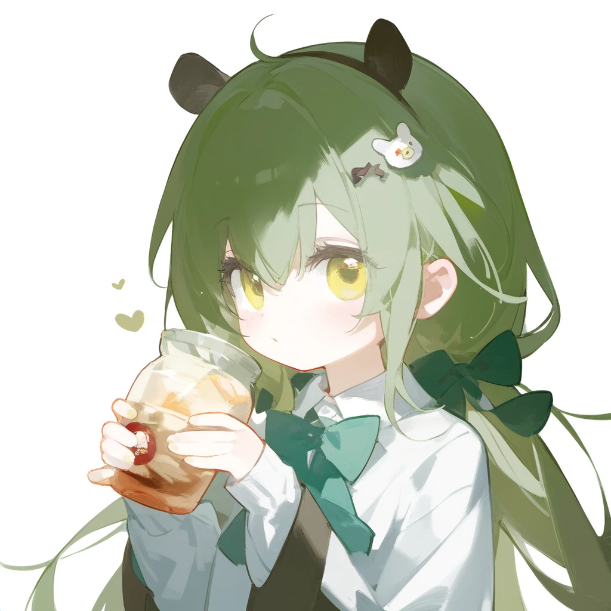
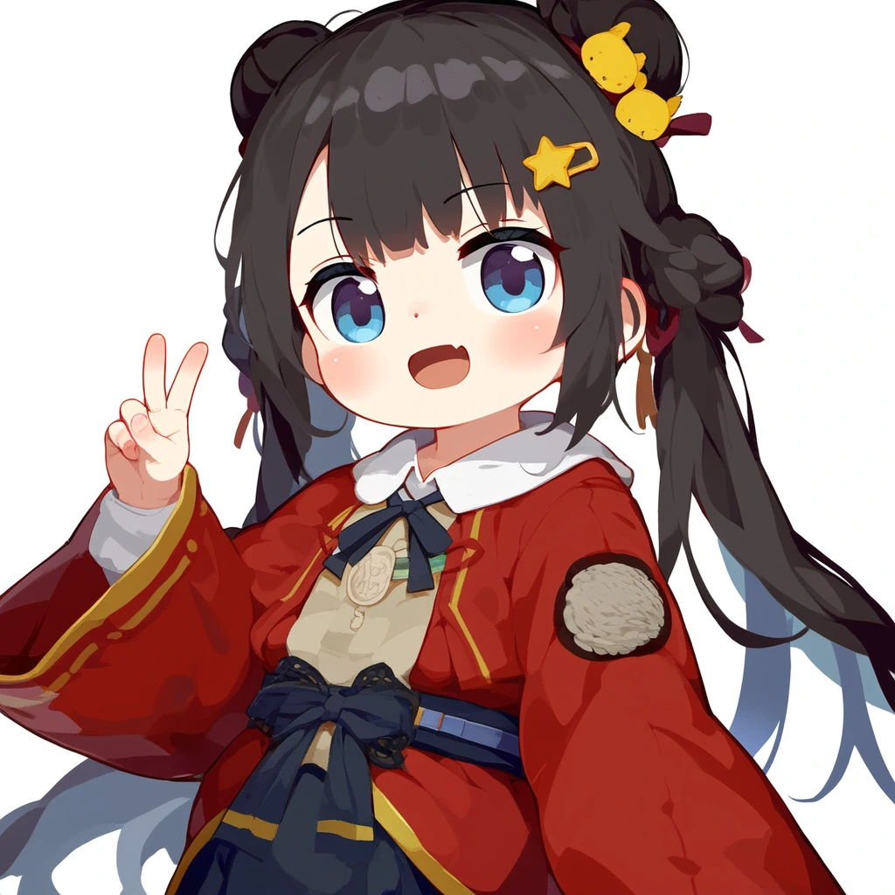
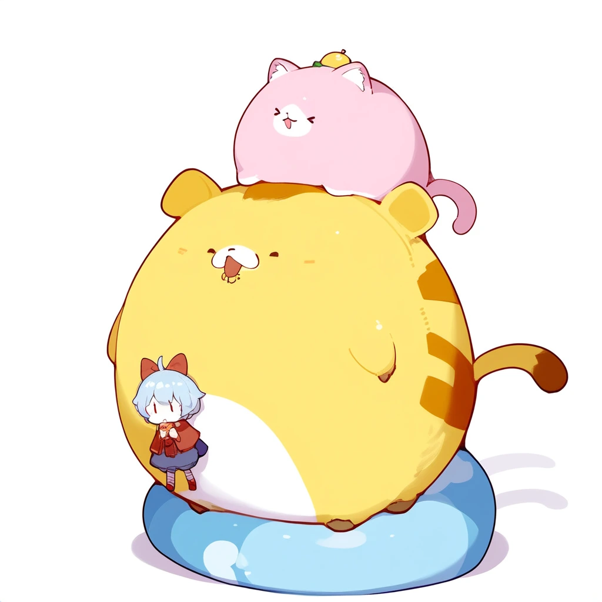
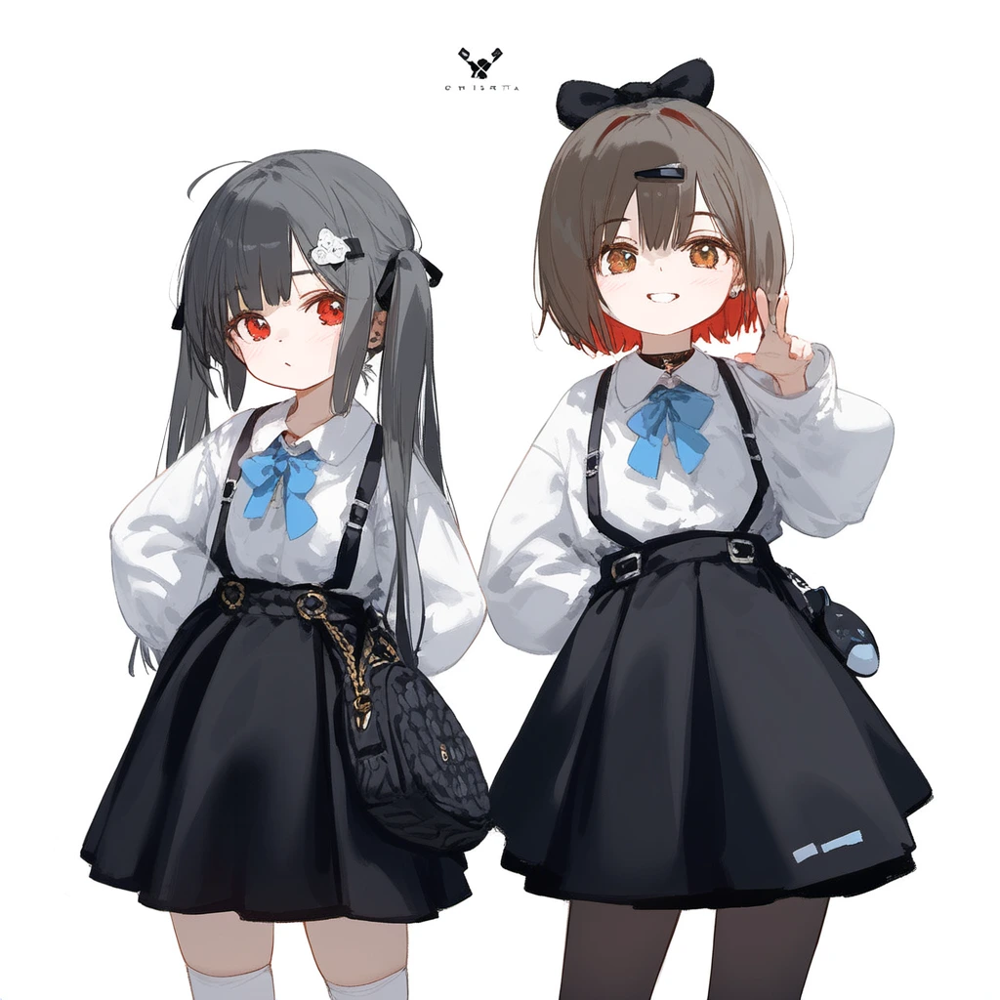
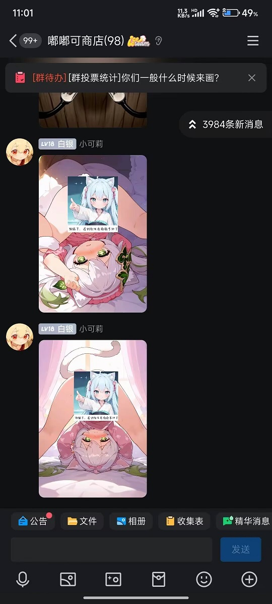

import { LinkCard, CardGrid } from '@astrojs/starlight/components';

# Nai3 篇：

### 介绍
- **画风**是由单个/多个画师串组合而成的
- 例如：\{ artist:ciloranko\} , [artist:tianliang duohe fangdongye], [artist:sho_(sho_lwlw)], [artist:baku-p ],  就是由4名画师名称组合而成
- 而最终画面效果取决于：
  - 画师名称的先后顺序
  - 画师名称的加减权重
    - \{\} 为加权
    - [] 为降权
- 所以定义画风就是排列组合各种画师名称
:::tip[偷偷地说]
聪明的小伙伴应该已经发现，这种排列组合几乎可以有**无限**种画风可能，所以需要各位小伙伴自己尝试组合了。
:::


### 736名画师名称
- 这里提供736名画师名已发现的画师名称供大家自行组合，不排除存在未收录的画师名称；
- 最好的方法是把自己熟悉的画师名称组合起来，而不是大海捞针；
- 当然，我们也准备了一些[常用画风串](#常用画风串)。

<details>
<summary>点我展开 736名画师名称</summary>

:::danger[注意！]
仅供群友查阅，未经允许谢绝转载
:::

```text title="736名画师名称"
artist:ciloranko,
artist:tianliang_duohe_fangdongye,
artist:ningen_mame,
artist:sho_(sho_lwlw),
artist:rhasta,
artist:wlop,
artist:kedama_milk,
artist:ask_(askzy),
artist:as109,
artist:mika_pikazo,
artist:ke-ta,
artist:WANKE,
artist:fuzichoco,
artist:modare,
artist:onineko,
artist:yoneyama_mai,
artist:reoen,
artist:chen_bin,
artist:kawacy,
artist:mignon,
artist:hiten,
artist:ATDAN,
artist:miv4t,
artist:henreader,
artist:sy4,
artist:rei_(sanbonzakura),
artist:mochizuki_kei,
artist:Rella,
artist:anmi,
artist:tidsean,
artist:minaba_hideo,
artist:akizero1510,
artist:cierra_(ra-bit),
artist:kantoku,
artist:cogecha,
artist:ogipote,
artist:kazutake_hazano,
artist:fujiyama,
artist:omone_hokoma_agm,
artist:amazuyu_tatsuki,
artist:toosaka_asagi,
artist:fkey,
artist:miyuki_(miyuki0529),
artist:hitomaru,
artist:alphonse_(white_datura),
artist:akakura,
artist:sheya,
artist:gomzi,
artist:kousaki_rui,
artist:cutesexyrobutts,
artist:liduke,
artist:40hara,
artist:ikeuchi_tanuma,
artist:konya_karasue,
artist:lam_(ramdayo),
artist:nardack,
artist:xinzoruo,
artist:icomochi,
artist:phantom_ix_row,
artist:namie,
artist:pigeon666,
artist:demizu_posuka,
artist:onono_imoko,
artist:shion_(mirudakemann),
artist:rurudo,
artist:binggong_asylum,
artist:tokkyu,
artist:asakuraf,
artist:kuzuvine,
artist:jyt,
artist:maccha_(mochancc),
artist:hxxg,
artist:fagi_(kakikaki),
artist:yoshida_akihiko,
artist:chiaroscuro,
artist:you_shimizu,
artist:kukka,
artist:infukun,
artist:kaamin_(mariarose753),
artist:ishiyumi,
artist:naga_u,
artist:tyakomes,
artist:momoco,
artist:Torino,
artist:houkisei,
artist:yushe_quetzalli,
artist:dino_(dinoartforame),
artist:meion,
artist:yuuhagi_(amaretto-no-natsu),
artist:quasarcake,
artist:fajyobore,
artist:hiro_(dismaless),
artist:miyase_mahiro,
artist:piromizu,
artist:shimatani_azu,
artist:maeka_(kumaekake),
artist:ru_zhai,
artist:shanyao_jiang_tororo,
artist:ryou(ryoutarou),
artist:alchemaniac,
artist:karasu_raven,
artist:hoji(hooooooooji1029),
artist:kinhasu,
artist:momoko_(momopoco),
artist:yuuji_(and),
artist:milk_panda,
artist:yoshinari_you,
artist:baku-p,
artist:zhibuji_loom,
artist:asanagi,
artist:piyodera_mucha,
artist:eufoniuz,
artist:banishment,
artist:mikozin,
artist:yonchan,
artist:pottsness,
artist:shiro9jira,
artist:xilmo,
artist:tsubasa_tsubasa,
artist:redrop,
artist:aki99,
artist:dishwasher1910,
artist:potg(piotegu),
artist:nikorashi-ka,
artist:katahira_masashi,
artist:mikaze_oto,
artist:enkyo_yuuichirou,
artist:ohisashiburi,
artist:gusha_s,
artist:hews,
artist:noyu_(noyu23386566),
artist:nekojira,
artist:zuizi,
artist:observerz,
artist:u_u_zan,
artist:necomi,
artist:ashima_takumi,
artist:hisona_(suaritesumi),
artist:milkychu,
artist:sofra,
artist:yamakawa,
artist:nonco,
artist:daizu_(melon-lemon),
artist:refeia,
artist:sakura_(39ra),
artist:simao_(x_x36131422),
artist:misaka_12003-gou,
artist:cui_(jidanhaidaitang),
artist:nixeu,
artist:bee_(deadflow),
artist:beni_shake,
artist:toi8,
artist:shexyo,
artist:fishine,
artist:ireading,
artist:timbougami,
artist:butterchalk,
artist:happoubi_jin,
artist:rebecca_(keinelove),
artist:mamimi_(mamamimi),
artist:yago8_pp3,
artist:murata_range,
artist:morino_hon,
artist:harada_takehito,
artist:taitai,
artist:luicent,
artist:sumiyao_(amam),
artist:astg,
artist:yamamomo_(plank),
artist:blue-senpai,
artist:tsukareta_san,
artist:aikome_(haikome),
artist:kurumi_(recycllamo),
artist:nekoda_(maoda),
artist:healthyman,
artist:Morikura_En,
artist:wagashi_(dagashiya),
artist:himura_kiseki,
artist:tachikawa_mushimaro,
artist:novelace,
artist:shigure_ui,
artist:alpha_(alpha91),
artist:sencha_(senchat),
artist:say_hana,
artist:dungeon_meshi,
artist:konbu_wakame,
artist:menyoujan,
artist:alp,
artist:murata_yuusuke,
artist:QYS3,
artist:hisakata_souji,
artist:achiki,
artist:skyrick9413,
artist:ishikei,
artist:mashiro_shiki,
artist:silvertsuki,
artist:OKAZU,
artist:chyoel,
artist:norza,
artist:yd_(orange_maru),
artist:rucaco,
artist:himitsu_(hi_mi_tsu_2),
artist:yumenouchi_chiharu,
artist:azuuru,
artist:djheycha,
artist:ponzu(catponz),
artist:stu_dts,
artist:Kyokucho,
artist:kamitoge_supino,
artist:kitaku_(nakamachi_machi),
artist:mandrill,
artist:parsley-f,
artist:dsmile,
artist:ebimomo,
artist:shuri_(84k),
artist:echj,
artist:6_(yuchae),
artist:nadegata,
artist:k00s,
artist:naruse_hirofumi,
artist:quan_(kurisu_tina),
artist:agoto,
artist:popqn,
artist:ribiadan,
artist:qosic,
artist:deadnooodles,
artist:mamuru,
artist:shnva,
artist:ran'ou_(tamago_no_kimi),
artist:ayu_(mog),
artist:sasairebun,
artist:waterkuma,
artist:m_k,
artist:migolu,
artist:rune_(dualhart),
artist:fuya_(tempupupu),
artist:donguri_suzume,
artist:kaede_(sayappa),
artist:rinotuna,
artist:kokaki_mumose,
artist:risui_(suzu_rks),
artist:mochirong,
artist:sora_72-iro,
artist:gawako,
artist:watao,
artist:kase_daiki,
artist:toshizou_(0714),
artist:remsrar,
artist:hayana_neru,
artist:neco,
artist:rokita,
artist:puuzaki_puuna,
artist:mochi_(circle_rin),
artist:fumio_(rsqkr),
artist:huanxiang_heitu,
artist:creayus,
artist:wang_xi,
artist:kinta_(distortion),
artist:misaki12003,
artist:kitada_mo,
artist:bacius,
artist:beijuu,
artist:bukurote,
artist:songjikyo,
artist:shisantian,
artist:ttosom,
artist:KuroBlood,
artist:eip_(pepai),
artist:rukako,
artist:memmo,
artist:hoshi_(snacherubi),
artist:nibiiro_shizuka,
artist:shiratama_(shiratamaco),
artist:bm_tol,
artist:ebifurya,
artist:poco(asahi_age),
artist:nanase_nao,
artist:meito_(maze),
artist:qtonagi,
artist:itomugi-kun,
artist:fujima_takuya,
artist:null_(nyanpyoun),
artist:kani_biimu,
artist:hyouuma,
artist:mafuyu_(chibi21),
artist:mikami_mika,
artist:nuu_(nu-nyu),
artist:amaichi_esora,
artist:amashiro_natsuki,
artist:rubi-samaasanagi,
artist:toraishi_666,
artist:mvv,
artist:saku_usako_(rabbit),
artist:kanzakietc,
artist:sasa_onigiri,
artist:na_tarapisu153,
artist:gochisousama_(tanin050),
artist:takemori_shintarou,
artist:cool-kyou_shinja,
artist:kojima_takeshi,
artist:taketora_suzume,
artist:takeuchi_takashi,
artist:lambda_(kusowarota),
artist:cle_masahiro,
artist:yapo_(croquis_side),
artist:satou_kuuki,
artist:shiokonbu,
artist:zurikishi,
artist:ryota_(ry_o_ta),
artist:kylin,
artist:duoyuanjun,
artist:shimada_fumikane,
artist:ame_(uten_cancel),
artist:Endou_Okito,
artist:oyari_ashito,
artist:tira_27,
artist:void_0,
artist:ogata_tei,
artist:hong_bai,
artist:bigxixi,
artist:allenes,
artist:houraku,
artist:yuno385,
artist:mocha_(cotton),
artist:arsenixc,
artist:hagimorijia,
artist:asou_(asabu202),
artist:sarasadou_dan,
artist:shiina_kuro,
artist:john_kafka,
artist:yueko_(jiayue_wu),
artist:hagi_(ame_hagi),
artist:kuroduki_(pieat),
artist:maeda_hiroyuki,
artist:yutoka_mizu,
artist:suimya,
artist:noco,
artist:miwano_rag,
artist:bow_(bhp),
artist:doujinshi_doujin,
artist:kasumi_(skchkko),
artist:murakami_suigun,
artist:touzai(poppin_phl95),
artist:rolua,
artist:waka(wk4444),
artist:au_(d_elete),
artist:hito_komoru,
artist:zunta,
artist:komota_(kanyou_shoujo),
artist:tabi_(tabisumika),
artist:yuumei,
artist:rin_yuu,
artist:kawakami_masaki,
artist:koh_rd,
artist:k-suwabe,
artist:iuui,
artist:ajishio,
artist:marushin,
artist:solar_(happymonk),
artist:takatsuki_ichi,
artist:bbolalus,
artist:rin31153336,
artist:7010,
artist:yoru_nai,
artist:do_m_kaeru,
artist:hizuki_yayoi,
artist:nikaidou_kou,
artist:kannko_bokujou,
artist:suminagashi,
artist:mokufuu,
artist:koruri,
artist:saru,
artist:romi_(346_ura),
artist:mazjojo,
artist:xssh,
artist:si10ra,
artist:mountain_han,
artist:kahlua,
artist:gin00,
artist:muloli,
artist:higeneko,
artist:goma_satoshi,
artist:potetos7,
artist:azure_(capriccio),
artist:suzumi_(ccroquette),
artist:nanaken_nana,
artist:kotobuki_utage,
artist:shpo,
artist:umishima_senbon,
artist:gsusart,
artist:joman,
artist:shugao,
artist:komeshiro_kasu,
artist:maett,
artist:mo_(kireinamo),
artist:maki_keigo,
artist:maeshima_shigeki,
artist:ssambatea,
artist:miyoshi_yoshimi,
artist:natsuki_teru,
artist:nakano_maru,
artist:dede_(qwea_00000),
artist:takitarou,
artist:shuuko_(s_h_uuko),
artist:mura_karuki,
artist:shacho_(ko_no_ha),
artist:ocha_(popopogg),
artist:kaorihero,
artist:signalviolet,
artist:qi7pi,
artist:baocaizi,
artist:tobimura,
artist:misha_(ohds101),
artist:op_na_yarou,
artist:momose_(oqo),
artist:misekai_555,
artist:kita_senri,
artist:terrajin,
artist:13_(spice!!),
artist:tokiwa_midori_(kyokutou_funamushi),
artist:tama_(tama-s),
artist:tenobe,
artist:203wolves,
artist:matanonki,
artist:topia,
artist:poprication,
artist:barbarian_tk,
artist:nagishiro_mito,
artist:kazepana,
artist:terupancake,
artist:shimhaq,
artist:tsunako,
artist:rosuuri,
artist:shikimi_(yurakuru),
artist:nyum,
artist:rkrk,
artist:syhan,
artist:10mo,
artist:coyucom,
artist:shouu-kun,
artist:gearous,
artist:piripun,
artist:colis,
artist:ponytail_korosuke,
artist:hua_hua_de_meme,
artist:re_ghotion,
artist:hori_(hori_no_su),
artist:wata_(attaka_towel),
artist:saitou_naoki,
artist:koi_(koisan),
artist:idkuroi,
artist:haru_(hiyori-kohal),
artist:tachibana_roku,
artist:midori_foo,
artist:taesi,
artist:inudori,
artist:gya_(144),
artist:clear_glass_(mildmild1311),
artist:ookuma_nekosuke,
artist:gakky,
artist:hajika,
artist:deyui,
artist:kisaragi_yuu_(fallen_sky),
artist:ittokyu,
artist:ucmm,
artist:asatsuki_(fgfff),
artist:hanekoto,
artist:mappaninatta,
artist:kujou_karasuma,
artist:tetsurou_(fe+),
artist:ro\\xa0g\\xa0(oowack),
artist:sogawa,
artist:ainy,
artist:azuumori,
artist:myabit,
artist:miyuki_ruria,
artist:rui_(sugar3),
artist:criis-chan,
artist:aochoku,
artist:mamimu_(ko_cha_22),
artist:kouji_(campus_life),
artist:shirokitsune,
artist:kemachiku,
artist:hagoonha,
artist:haru_(nakajou-28),
artist:luke_(dydansgur),
artist:suisogenshi,
artist:namori,
artist:dadijiji,
artist:reitou_mikan,
artist:yuuka_nonoko,
artist:appleq,
artist:tsukinami_kousuke,
artist:tomozero,
artist:menma_(enaic31),
artist:hoojiro,
artist:turisasu,
artist:momiji_mao,
artist:aak,
artist:yukie_(kusaka_shi),
artist:mamyouda,
artist:miu_(miuuu_721),
artist:lamb-oic029,
artist:rariatto_(ganguri),
artist:keenh,
artist:huwari_(dnwls3010),
artist:mozukuzu_(manukedori),
artist:asazuki_norito,
artist:hyde_(tabakko),
artist:mendou_kusai,
artist:ett,
artist:niichi_(komorebi-palette),
artist:shichigatsu,
artist:akadako,
artist:swordsouls,
artist:sagami_jon,
artist:sui_(suizilla),
artist:dev_(dev0614),
artist:yoon_cook,
artist:nanoless,
artist:kz_oji,
artist:teshima_nari,
artist:yukataro,
artist:honlo,
artist:zuo_daoxing,
artist:yana_mori,
artist:massakasama,
artist:shashaki,
artist:ergot,
artist:nekoya_(liu),
artist:nekoume,
artist:yajuu,
artist:starshadowmagician,
artist:damda,
artist:saiguchi_otoufu,
artist:whoosaku,
artist:reddizen,
artist:sigm@,
artist:katsuobushi_(eba_games),
artist:amezawa_koma,
artist:uenomigi,
artist:kim_eb,
artist:e.o.,
artist:ini_(inunabe00),
artist:tunamayo_(dsasd751),
artist:cocozasa,
artist:mr.lime,
artist:ido_(teketeke),
artist:mochizuki_shiina,
artist:kame_(kamepan44231),
artist:yunamaro,
artist:nekotoufu,
artist:hekiga_(freelot),
artist:jill_07km,
artist:matanukinuki,
artist:kanikama,
artist:sincos,
artist:kouyafu,
artist:atte_nanakusa,
artist:loliconder,
artist:meinoss,
artist:nekonyan,
artist:x,
artist:band-width,
artist:e10,
artist:tooo,
artist:tamanoi_peromekuri,
artist:mx2j,
artist:kobuichi,
artist:tinker_bell,
artist:wasabi_(sekai),
artist:narduck,
artist:kimishima_ao,
artist:Mizumizuni,
artist:kankan33333,
artist:muk_monsieur,
artist:suitenan,
artist:miraa_(chikurin),
artist:isshi_pyuma,
artist:s16xue,
artist:sorairo_len,
artist:dango_(uni_520),
artist:meyoco,
artist:yuzuna99,
artist:yokochou,
artist:bai_lao_shu,
artist:nopossumachine,
artist:amonitto,
artist:falin_thorden,
artist:sawkm,
artist:da_mao_banlangen,
artist:choco_(chocolate_shop),
artist:Fuumi,
artist:Shirabi,
artist:Sayori,
artist:Ichihi,
artist:shoshika8888888,
artist:kurarome,
artist:haneru,
artist:asakai_mocchinu,
artist:monikano,
artist:hakaba_(dairiseki),
artist:shironekoban,
artist:hidulume,
artist:meunhongcha,
artist:jonylaser,
artist:kazuhiro_(tiramisu),
artist:shengtian,
artist:nopetroto,
artist:namiorii,
artist:darklux,
artist:rotroto,
artist:namagome_negi,
artist:shimejinameko,
artist:freng,
artist:riri,
artist:weri,
artist:sciamano240,
artist:pukara,
artist:noah_(tettsui-sole),
artist:OlchaS,
artist:kidmo,
artist:melon22,
artist:kincora,
artist:batako,
artist:38,
artist:kunaboto,
artist:elun_(meido),
artist:kakure_eria,
artist:Jonpei,
artist:icecake,
artist:qizhu,
artist:reeh_(yukuri130),
artist:hougu_souji,
artist:umezawa_itte,
artist:wenquangua,
artist:dokuro_deluxe,
artist:csyday,
artist:mimoza_(96mimo414),
artist:shirable_shiki,
artist:maiqo,
artist:jacknife,
artist:you_guo_chaocai,
artist:douya_(233),
artist:fenrir_(fenriluuu),
artist:gorgeous_mushroom,
artist:yaegashi_nan,
artist:aka_kan,
artist:dm_(dai_miao),
artist:rororogi_mogera,
artist:ideolo,
artist:nababa,
artist:pumpkinspicelatte,
artist:ruton-niki,
artist:asciamano240,
artist:ZED,
artist:carbon12th,
artist:ayagi_daifuku,
artist:usashiro_mani,
artist:phtharticpaul,
artist:Ito_Junji,
artist:atsuage_(kakinop),
artist:tsujii_ruki,
artist:sukja,
artist:takejun,
artist:zantyarz,
artist:saitou_natsuki,
artist:ayul_(ayulneri_92),
artist:yuyu_(yuyuworks),
artist:porforever,
artist:mogumo,
artist:shuz,
artist:saintshiro,
artist:ratatatat74,
artist:harogen_pabirion,
artist:shiroshi_(denpa_eshidan),
artist:kanda_done,
artist:eta,
artist:bison_cangshu,
artist:yunsang,
artist:redi_(rasec_asdjh),
artist:jima,
artist:sarcophage,
artist:bilibili_xiaolu,
artist:Yuko_Shimizu,
artist:kurahana_chinatsu,
artist:ixima,
artist:araki_hirohiko,
artist:tandohark,
artist:muchi_maro,
artist:itou_tatsuya,
artist:hungry_clicker,
artist:imaishi_hiroyuki,
artist:mdf_an,
artist:cha_chya,
artist:ichika_(ichika87),
artist:leviathan_(hikinito0902),
artist:reoenl,
artist:sakimori_(hououbds),
artist:muuran,
artist:nanmokaken,
artist:tokiame,
artist:nineo,
artist:senryoko,
artist:sky_cappuccino,
artist:yuzuyomogi,
artist:riyo_(lyomsnpmp),
artist:kaneko_(bblogtinhan),
artist:xiujia_yihuizi,
artist:shinapuu,
artist:rosumerii,
artist:kishiyo,
artist:ao+beni,
artist:marumoru,
artist:gweda,
artist:kyockcho,
artist:blade_(galaxist),
artist:musashi_(detks),
artist:tomose_shunsaku,
artist:missile228,
artist:kaigen_1025,
artist:nanashi_(nlo),
artist:lm7(op-center),
artist:kuromiya,
artist:avogado6,
artist:tony_taka,
artist:miyo_(ranthath),
artist:daifuku_mame_(kageroudt33),
artist:lpip,
artist:kaninn,
artist:Kinty,
artist:kinako,
artist:tiv,
artist:ixy,
artist:Bae.c,
artist:fangdan_runiu,
```

</details>


### 常用画风串
<details>
<summary>雪糕4件套</summary>


artist: ciloranko, [Artist: Sho_(sho_LWLW)], [Artist: baku-p], [Artist: Tsubasa_tsubasa],

</details>

<details>
<summary>可爱4件套</summary>


artist:ciloranko , [artist:sho_(sho_lwlw)], [[artist:tianliang_duohe_fangdongye]],[[[[[[artist:kani_biimu]]]]]]

</details>

<details>
<summary>可爱6件套</summary>


artist:ciloranko, [artist:tianliang duohe fangdongye], [artist:sho_(sho_lwlw)], [artist:baku-p], [artist:aki99],

</details>

<details>

<summary>萝莉5件套</summary>


artist:ciloranko, [artist:tianliang duohe fangdongye], [artist:sho_(sho_lwlw)], [artist:baku-p], [artist:tsubasa_tsubasa],

</details>

<details>
<summary>萝莉7件套</summary>


artist: ciloranko, [artist: tianliang duohe fangdongye], [artist: sho_(sho_lwlw)], [artist: baku-p], [artist:tsubasa_tsubasa], [[artist:as109]], [[artist:rhasta]],

</details>

<details>
<summary>水彩画风</summary>


\{hokori sakuni\}, \{ciloranko\}, \{ke-ta\}, \{houkisei\},\{kedama milk\},

</details>

<details>
<summary>动画画风</summary>


artist:pu hua, artist:shiratamaco, artist:tianliang duohe fangdongye, 

</details>

<details>
<summary>海报画风</summary>


artist:ciloranko, \{artist:menthako\}, \{artist:tianliang duohe fangdongye\}, [artist:sho (sho lwlw)], [artist:baku-p], [[[artist:tsubasa tsubasa]]], artist: kemo camotli,

</details>

<details>
<summary>鲜艳色彩画风</summary>


[artist:ningen_mame], \{\{\{ciloranko}}}, [artist:sho_(sho_lwlw)], [[artist:rhasta]], [artist:wlop], [artist:ke-ta],

</details>

<details>
<summary>更多画风</summary>

（请潜伏在[群里](/aboutus)获取）


</details>

### 常用质量词条

<details>
<summary>NovelAi官方</summary>

best quality, amazing quality, very aesthetic,absurdres

</details>

<details>
<summary>黄昏逆光</summary>

realistic,reverse light,golden light, best quality, amazing quality, very aesthetic,absurdres

</details>

### NovelAi 的开源元素法典

<details>
<summary>🍓[点我展开]</summary>

<LinkCard
  title="300画风法典"
  description="NAI3画风收集和研究"
  href="https://www.nep6.com:8806/"
/>
<LinkCard
  title="精简200画师法典"
  description="本表格为精简版纯粹的个人向榜单，内容有不可避的不完善和偏向性等问题"
  href="https://docs.qq.com/sheet/DSUd5eGRCZ0tFcGZJ"
/>
<LinkCard
  title="法典目录"
  description="本网页的法典目录"
  href="../../../法典/法典目录/"
/>


</details>


