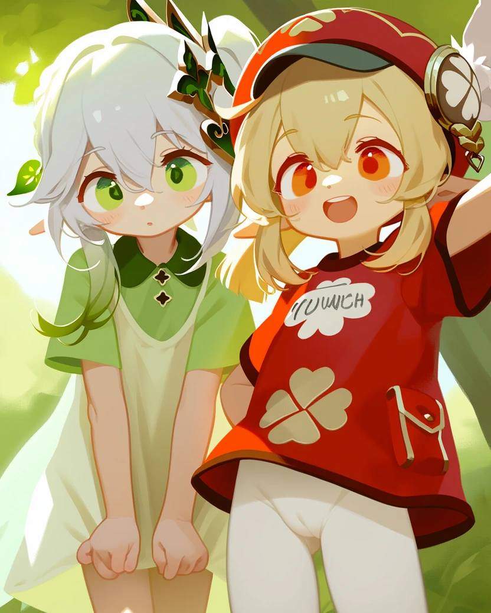
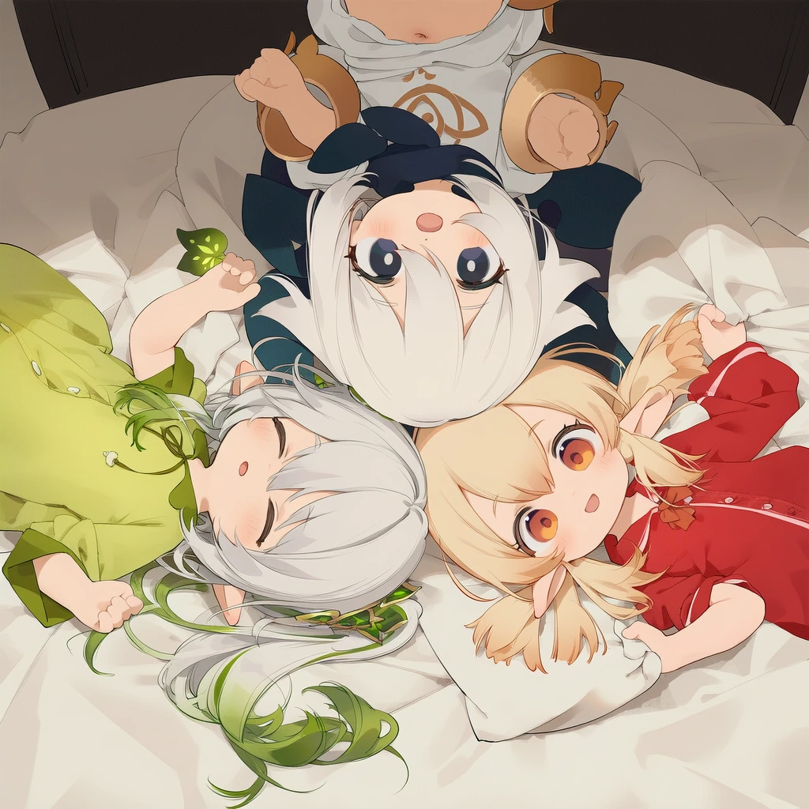
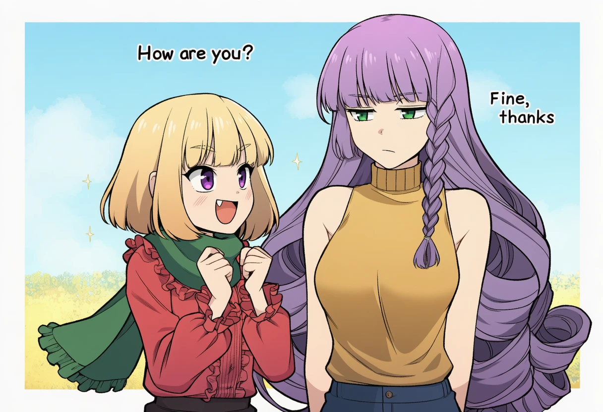

import { Tabs, TabItem } from '@astrojs/starlight/components';

:::note
以下内容基于 nai4 full 正式版 和 nai4.5 测试版
:::

### nai4画师和画风的改进点：

*   **多角色提示**：支持在单个图像中为多达六个不同角色分别指定提示，并减少角色间的信息泄漏。
*   **动作标签**：可以使用 `source#`, `target#` 或 `mutual#` 前缀指定动作标签，以便更清晰地描述角色间的互动；例如：`source#hug` （发起拥抱的角色）, `target#hug` （被拥抱的角色）, `mutual#hug` （互相拥抱的角色）。
*   **渲染文本**：V4 模型能够生成更清晰易读的英文文本，例如使用 `Text: HAVE FUN!,` 来指定角色说出"HAVE FUN!"；同时也可以使用 `no text,` 标签减少文本生成。
*   **内置Furry模型**：喜欢毛茸茸的用户，可以使用 `fur dataset,` 标签来启动提示词，像以前的毛茸茸模型一样使用。
*   **新增特殊标签和短语**：包括 `Character Study`、`photo (medium), photographic doll`、 `artist:ainiwaffles` 等。自然语言描述也能影响图像的艺术风格，如使用 `highly finished`、`digital illustration` 等短语。

### nai4.5的改进点：

*   可以更精确地进行[渲染文本](#渲染文本)。
*   相比于nai4，终于算是能用了...

---

### Bot指令：

<Tabs syncKey="版本">

  <TabItem label="nai4" icon="star">
```text
#绘画nai4模型artist:nanmokaken, artist:sho_(sho_lwlw), artist:tianliang duohe fangdongye, [artist:shiratamaco], [artist:nekoshoko], [[artist:alkemanubis]], 2girl, loli, amazing quality, very aesthetic, absurdres, 

{人物 nahida (genshin impact), {位置左} 人物}, 

{人物 klee (genshin impact), t-shirt, white pantyhose, {位置右}, ntags = hat, bag 人物}
```



> *图注：nai4 full 生成*

  </TabItem>


  <TabItem label="nai4.5" icon="sun">
```text
#绘画nai4.5模型方图artist:nanmokaken, artist:sho_(sho_lwlw), artist:tianliang duohe fangdongye, [artist:shiratamaco], [artist:nekoshoko], [[artist:alkemanubis]], loli, amazing quality, very aesthetic, absurdres, 3girls, group, pajamas, {{{lying}}}, {{{on bed}}}, bed, bedroom, bed sheet, pillows, soft lighting, {{{from above}}}, {{{top-down view}}}, {{{heads together}}}, {{heads touching}}, {{{circle of heads}}}, {{{radial symmetry}}}, hair spread out,

{人物 paimon (genshin impact), {位置上} 人物},

{人物 nahida (genshin impact), {位置左下} 人物},

{人物 klee (genshin impact), {位置右下}, t-shirt, white pantyhose, ntags = hat, bag 人物}
```



> *图注：nai4.5 测试版生成*

  </TabItem>

</Tabs>

#### 多角色指令解析：
- 除了定义整体的画面之外，还可以独立指定每个角色
- `{人物 [tags], {位置xx}, ntags = [ntags] 人物}`
  - **多角色提示输入框**：每个角色用 `{人物 [tags] 人物}` 包裹起来，最多可指定`6名`角色
  - **定义角色特征**：在 `[tags]` 中写入你所定义的角色特征——画风、动作、神态、外貌等等
  - **定义人物位置**： `{位置中}` `{位置左}` `{位置左上}` `{位置左下}` `{位置左左}` `{位置右}` `{位置右下}`  `{位置右右下下}` 等，共定义 `5*5=25` 种位置
  - **定义反面词条**：与定义整体相同，直接在 `{人物 [tags] 人物}` 中使用 `ntags = [ntags]` 即可

:::note
- 多角色指令 `{人物 [tags] 人物}` 在nai4绘画中是**可选**的，你依然可以像nai3一样将角色定义在整体画面中
- 当你决定使用多角色指令时，指令中的 `{人物 [tags] 人物}` 中的2个`人物`是占位符**不能被删除**，否则将无法识别多角色指令
- 如果所有人物都不设置**位置**的话，则自动开启nai4中的“AI选择位置”选项
:::

### 同时定义6个小可爱！
<Tabs syncKey="版本">

  <TabItem label="nai4" icon="star">
```text
#绘画nai4模型 6girls, loli, amazing quality, very aesthetic, absurdres, masterpiece,

{人物 paimon (genshin impact) 人物}, 

{人物 nahida (genshin impact), {位置左} 人物}, 

{人物 klee (genshin impact), t-shirt, white pantyhose, {位置右}, ntags = hat, bag 人物}

{人物 sayu (genshin impact)， {位置左左下下} 人物}, 

{人物 diona (genshin impact), {位置右右下下} 人物}, 

{人物 yaoyao (genshin impact), black pantyhose, {位置上上}, ntags = bag 人物}

ntags = blurry, lowres, error, film grain, scan artifacts, worst quality, bad quality, jpeg artifacts, very displeasing, chromatic aberration, logo, dated, signature, multiple views, gigantic breasts
```
  </TabItem>


  <TabItem label="nai4.5" icon="sun">
```text
#绘画nai4.5模型 6girls, loli, amazing quality, very aesthetic, absurdres, 

{人物 paimon (genshin impact) 人物}, 

{人物 nahida (genshin impact), {位置左} 人物}, 

{人物 klee (genshin impact), t-shirt, white pantyhose, {位置右}, ntags = hat, bag 人物}

{人物 sayu (genshin impact)， {位置左左下下} 人物}, 

{人物 diona (genshin impact), {位置右右下下} 人物}, 

{人物 yaoyao (genshin impact), black pantyhose, {位置上上}, ntags = bag 人物}

ntags = blurry, lowres, error, film grain, scan artifacts, worst quality, bad quality, jpeg artifacts, very displeasing, chromatic aberration, multiple views, logo, too many watermarks
```
  </TabItem>

</Tabs>

### 渲染文本

#### 示例：



<Tabs syncKey="版本">

  <TabItem label="nai4" icon="star">
```text
nai4 不支持哦，请转到 nai4.5 标签页
```
  </TabItem>


  <TabItem label="nai4.5" icon="sun">
```text
#绘画nai4.5模型 girls, text, english text, location, -1::monochrome, speech bubble, simple background ::, looking at another, masterpiece, best quality, rating:general. The blonde girl is excitedly asking "How are you?" and the purple haired girl is responding "Fine, thanks" with a bored expression on her face. Text: How are you?

Fine, thanks
| 1girl, purple eyes, short hair, ruffled blouse, red blouse, blonde hair, green scarf, blunt bangs, fang, small breasts, long sleeves, bob cut
| 1girl, very long hair, purple hair, curly hair, golden shirt, full body, green eyes, turtleneck sweater, sleeveless turtleneck, side braid, medium breasts, sleeveless
```
  </TabItem>

</Tabs>

> _注释：上面的 tags 语法使用了 [nai4.5 数值权重](/nai3bot指南/绘画高级指令#数值权重) 语法以及 [nai3/SD 通用多角色](#渲染文本) 语法_

### 其他

:::danger[注意]
- nai4 full正式版 暂不支持：smea，输入将返回500错误。
:::