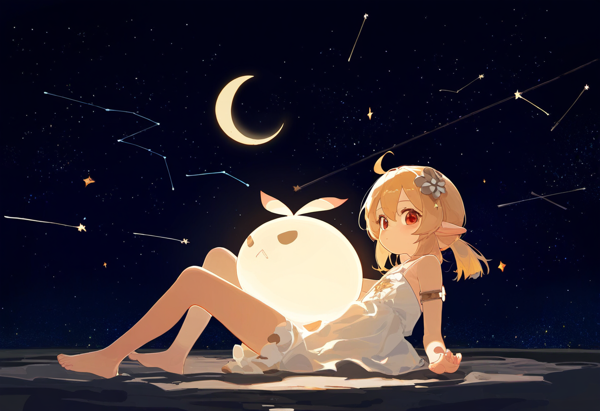

## #绘画+画师串+描述词+质量词条

:::note[举个例子]
- #绘画横图 [[klee(genshin impcat)]],artist:ciloranko, [artist:tianliang duohe 
fangdongye], [artist:sho_(sho_lwlw)], [artist:baku-p],  [artist:baku-p],star sky, starry sky, 1girl, barefoot,night sky,space,sky,shooting star,night,solo,moon,feet,rating:safe,full moon,sparkle,hair ornament,starry sky print, {{constellation}},looking at viewer,hair between eyes, armlet,starry background, closed mouth, eyebrows visible through hair,  jewelry, crescent moon, Floating in the air,{{lying}},Slightly lift the leg,{best quality, amazing quality, very aesthetic, absurdres,realistic,reverse light,golden light,},warm-toned,, best quality, amazing quality, very aesthetic, absurdres
```
- 我们把词条称之为tags
```
:::
### 分步解析
:::tip[#绘画]
这个是机器人绘画指令
```
定义图片长宽:
  #绘画横图/竖图/方图
```
:::
:::danger[定义角色]
- klee(genshin impcat)
- 可莉(原神)；这个是国际服可莉的名字,()里面的是国际服的原神名字,也可以在D站寻找角色的名字,这个我们后面讲
:::
:::caution[定义画风]
- artist:ciloranko, [artist:tianliang duohe fangdongye], [artist:sho_(sho_lwlw)], [artist:baku-p],  [artist:baku-p],
- 这个是画师组合串,不同的画师组合出不同的画风风格,可以自己调制也有大佬分享的

:::
:::note[定义画面描述]
- star sky, starry sky, 1girl, barefoot,night sky,space,sky,shooting star,night,solo,moon,feet,rating:safe,full moon,sparkle,hair ornament,starry sky print, {{constellation}},looking at viewer,hair between eyes, armlet,starry background, closed mouth, eyebrows visible through hair,  jewelry, crescent moon, Floating in the air,{{{lying}}},Slightly lift the leg,
```
[]：减少tag在施法串中的权重，可多次使用进行加权
{}：增加tag在施法串中的权重，可多次使用进行加权
```

- 这一大串是描述串，包含了，背景，服饰，装饰等描述串
:::
:::tip[质量词条]
- best quality, amazing quality, very aesthetic, absurdres,realistic,reverse light,golden light,warm-toned
- 这一串是质量描述串，指定生成出来的图画要精致一些，还是要潦草一些
:::

### 结果
- 把那一串发给机器人之后，机器人会返回：




### 碎碎念
-  这两张图就是刚刚的tags串所生成出来的图片
这个施法串中的画风并不怎么好看，这是很常见的
所以可以自己调整画风
或者有大佬分享的画风可以使用，要好好谢谢大佬哦
以及，AI出的图有瑕疵是非常非常正常的一件事情
你们现在所看到的好看的AI图都是大佬们从几千张图中挑选出来的几张
几千张可不是玩笑哦？！所以出图有瑕疵不要气馁，就像抽卡一样
下一张说不定会更好哦