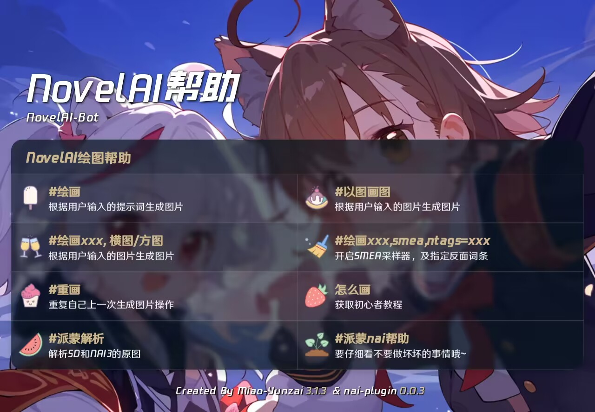

## 获取指令
- 可以通过 #绘画帮助 来获得绘画指令

## 常用指令

- 可以通过 #派蒙nai帮助 来获得更多指令
:::tip[#派蒙nai帮助]
派蒙nai绘画指令：
 #绘画[tags],
 #以图画图[tags],

tags的额外触发词：
   竖图/横图/方图,
   毛茸茸模型,
 使用特殊采样器：
   smea,
 关闭DYN的SMEA采样器：
   smea, dynoff,
 指定反面词条：
   ntags = [tags],
 引用图片：
   引用的图片作为参考图片

 #派蒙nai查看默认反面提示词
 #派蒙解析
   解析引用图片的png信息
 #裁决
 #派蒙眼中的[我|@at][pro]
 :::
 
