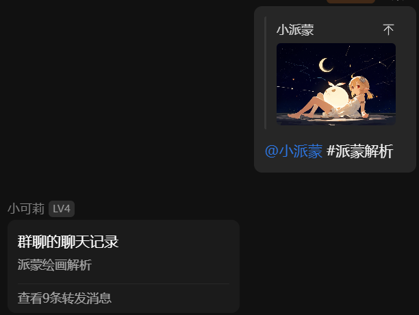

- 引用图片后给机器人发送 #派蒙解析
- 可获取该图片的png信息
  - 理论上使用该png的信息可以100%重新生成一模一样的原图



:::note[派蒙解析]
模型：Stable Diffusion XL C1E1DE52D

[[klee(genshin impcat)]],artist:ciloranko, [artist:tianliang duohe 
fangdongye], [artist:sho_(sho_lwlw)], [artist:baku-p],  [artist:baku-p],star sky, starry sky, 1girl, barefoot,night sky,space,sky,shooting star,night,solo,moon,feet,rating:safe,full moon,sparkle,hair ornament,starry sky print, {{constellation}},looking at viewer,hair between eyes, armlet,starry background, closed mouth, eyebrows visible through hair,  jewelry, crescent moon, Floating in the air,{{lying}},Slightly lift the leg,{best quality, amazing quality, very aesthetic, absurdres,realistic,reverse light,golden light,},warm-toned, best quality, amazing quality, very aesthetic, absurdres
```json
{
  "prompt": " [[klee(genshin impcat)]],artist:ciloranko, [artist:tianliang duohe \nfangdongye], [artist:sho_(sho_lwlw)], [artist:baku-p],  [artist:baku-p],star sky, starry sky, 1girl, barefoot,night sky,space,sky,shooting star,night,solo,moon,feet,rating:safe,full moon,sparkle,hair ornament,starry sky print, {{constellation}},looking at viewer,hair between eyes, armlet,starry background, closed mouth, eyebrows visible through hair,  jewelry, crescent moon, Floating in the air,{{lying}},Slightly lift the leg,{best quality, amazing quality, very aesthetic, absurdres,realistic,reverse light,golden light,},warm-toned, best quality, amazing quality, very aesthetic, absurdres",
  "steps": 28,
  "height": 832,
  "width": 1216,
  "scale": 5,
  "uncond_scale": 0,
  "cfg_rescale": 0,
  "seed": 6059128477,
  "n_samples": 1,
  "hide_debug_overlay": false,
  "noise_schedule": "native",
  "legacy_v3_extend": false,
  "reference_information_extracted_multiple": [],
  "reference_strength_multiple": [],
  "sampler": "k_euler",
  "controlnet_strength": 1,
  "controlnet_model": null,
  "dynamic_thresholding": false,
  "dynamic_thresholding_percentile": 0.999,
  "dynamic_thresholding_mimic_scale": 10,
  "sm": false,
  "sm_dyn": false,
  "skip_cfg_below_sigma": 0,
  "lora_unet_weights": null,
  "lora_clip_weights": null,
  "uc": "lowres, {bad}, error, fewer, extra, missing, worst quality, jpeg artifacts, bad quality, watermark, unfinished, displeasing, chromatic aberration, signature, extra digits, artistic error, username, scan, [abstract],    censored, mosaic, signature, watermark, username, weibo_username,",
  "request_type": "PromptGenerateRequest",
  "signed_hash": "LTG/OdiXQGTohDShKaPSjYZ4RBmLzgek2AzwOGXMLTCPmvWBnmfZ1MJw8jkEOcOoOdjxJ4xmdVT7nRumN/YIBQ=="
}
```
:::